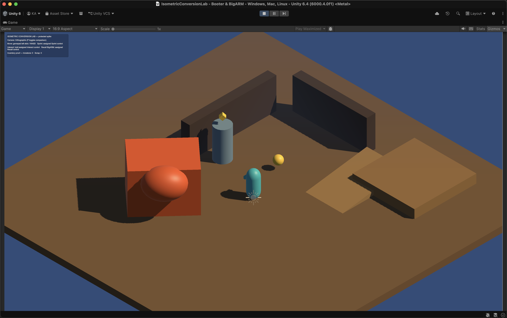
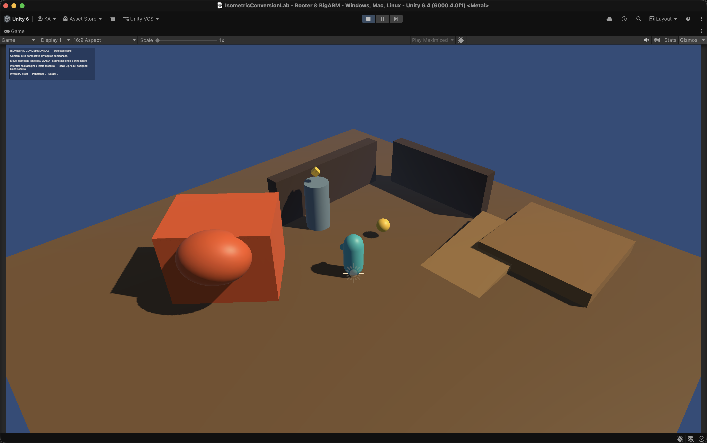
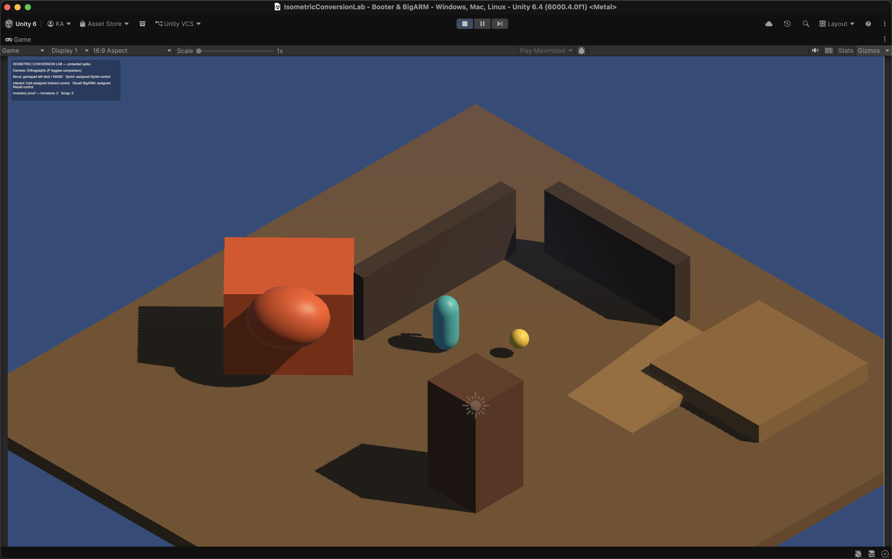
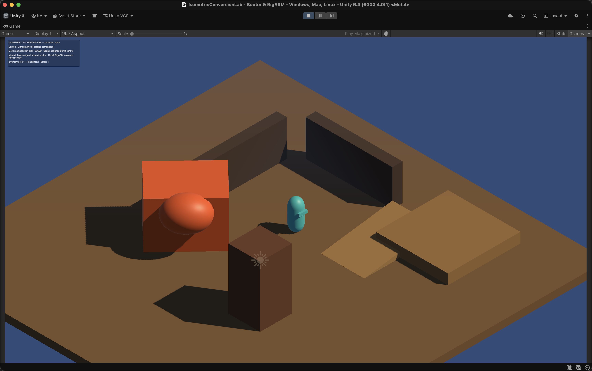
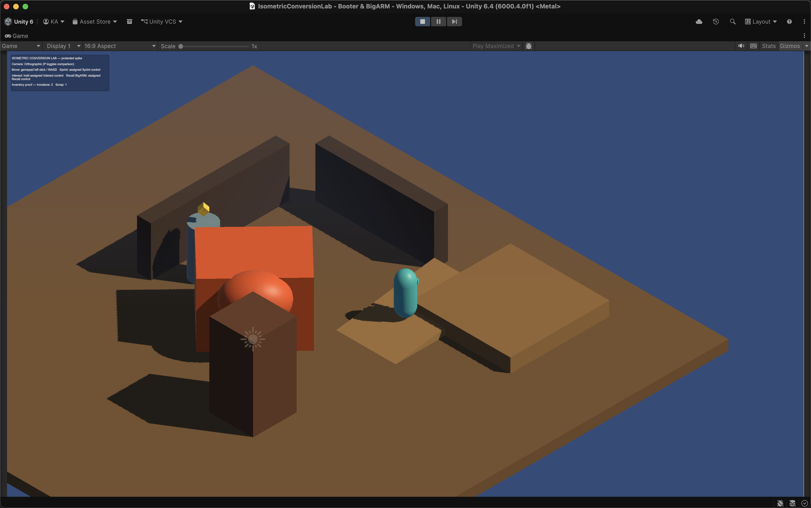

# Protected Isometric Spike Report — 2026-08-12

**Program:** CP-01 through CP-06 of `3D_CONVERSION_AUDIT_AND_CHECKLIST.md`
**Execution owner:** Gottspan
**Unity version:** `6000.4.0f1`
**Result:** Technical spike implemented and evidence-ready; stopped at the CP-06 user acceptance gate

## Outcome

The existing Unity project can support a parallel 3D, top-down isometric-style presentation without restarting the project or damaging the current 2D prototype.

The protected lab now demonstrates:

- a separate Universal 3D renderer at renderer index 1 while `Renderer2D.asset` remains the default at index 0;
- a separate `IsometricConversionLab.unity` scene that is not enabled in Build Settings;
- fixed-yaw Cinemachine framing with orthographic and footprint-calibrated mild-perspective comparison modes;
- camera-relative 3D Rigidbody movement with diagonal input clamping, acceleration, deceleration, sprint support, facing, collision, and a traversable ramp;
- a deliberate camera-side occluder with temporary binary hide/reveal behavior;
- a 3D harvest node with a world-space marker, hold interaction, inventory delivery, depletion, and respawn;
- a 3D trigger pickup with inventory delivery and removal;
- a large placeholder BigARM with camera-relative screen-left follow and recall positioning;
- project-owned greybox materials, directional lighting, ambient fill, restrained fog, and a light color-adjustment volume;
- a non-mutating preservation validator and a focused EditMode test assembly.

## Proof Summary

| Proof | Result |
| --- | --- |
| Unity script compilation | Pass; runtime, editor, and test assemblies compiled without C# errors |
| Conversion EditMode suite | Pass — 8 passed, 0 failed, 0 skipped, 0 inconclusive |
| Preservation validator | Pass after final scene rebuild and live playtesting |
| Legacy `PrototypeScene.unity` SHA-256 | Unchanged: `fab742d6de621ca5414d9f2ca273ce82ba1cbec52ca78e72a3a4437d50b6d9a7` |
| Legacy `SampleScene.unity` SHA-256 | Unchanged: `387d8216a517be775b6ecc2ab55b97ece687c3372322da2ba027a96908014912` |
| Legacy `Renderer2D.asset` SHA-256 | Unchanged: `0ad61c87afceceb7d18b08c9fe35d2e36a89640d5af073be0e9cec5839bf1516` |
| `EditorBuildSettings.asset` SHA-256 | Unchanged: `882bc38bca9cd5fe492cafb3583935c997bcbc691e50bcc7451ba2ddfffc8b5a` |
| Keyboard movement | Live pass with WASD; camera-relative direction, wall collision, BigARM side follow, and camera tracking observed |
| Ramp traversal | Live pass across the corrected ground-to-pad slope |
| Harvest interaction | Live pass; hold E delivered 2 ironstone and hid the depleted node and marker |
| Pickup interaction | Live pass; trigger collection delivered 1 scrap and removed the pickup |
| Lens toggle | Live pass; P toggled orthographic and calibrated 48-degree mild perspective |
| Runtime exceptions during final evidence pass | None observed in the Unity Editor log |

## Visual Evidence

### Orthographic working default

### Mild-perspective comparison

### Harvest proof

The overlay shows two ironstone after the node and its yellow world-space marker have depleted.

### Pickup and movement proof

The overlay shows one scrap after the yellow pickup has been collected.

### Ramp, occlusion, and BigARM scale proof

## Corrections Made During The Spike

The spike surfaced and resolved three issues before the acceptance gate:

1. BigARM initially followed behind Booter in movement space and obscured the player. Its temporary follow position now stays camera-relative screen-left.
2. The first mild-perspective setting was too tight at 35 degrees. It now uses 48 degrees to approximately match the orthographic view footprint at the configured camera distance.
3. The first ramp slope was reversed and did not meet the raised pad. The corrected shallow ramp moves from ground height to the pad height and passed live traversal.

The focused suite also found that direct BigARM recall could occur before its Rigidbody cache was initialized. The recall path now resolves its body defensively.

## Preserved Boundaries

- No package was installed or changed.
- No production asset was purchased, commissioned, downloaded, or licensed.
- No legacy scene, prefab, sprite, tilemap, or 2D renderer was edited by this conversion batch.
- Build Settings were not changed; the conversion lab is intentionally excluded.
- The existing user-owned dirty RuleGround and PSD files were not staged or modified by the conversion work.
- Touch, Joystick, XR, Attack, and Jump were not brought into the conversion scope.
- No save schema, procedural world, survival loop, production BigARM AI, production UI, or legacy cleanup was started.

## Known Gaps Before CP-07

- Gamepad bindings exist structurally, but no physical gamepad playtest was completed in this evidence pass.
- Camera feel, final lens, BigARM scale, and binary occlusion still need the user's visual/play acceptance.
- The binary occlusion experiment is a proof mechanism, not the final fade/cutaway treatment.
- The lab interaction components are explicitly temporary spike implementations; CP-07 must create shared seams before current-loop parity work.
- Save/load, survival pressure, canister behavior, full BigARM commands/state, and procedural world output remain on the protected 2D path.
- No player build was made because enabling or otherwise building the conversion lab would cross the intentional Build Settings gate.
- Shipping platforms, performance budgets, art family, production asset sourcing, navigation package choice, and final collision layers remain undecided.

## Gottspan Recommendation

Proceed to CP-07 after user acceptance, keeping orthographic as the working default and retaining mild perspective only as a comparison until the user chooses. The spike supports continuing in the existing project; a restart is not justified.

The next implementation batch should be the shared traversal/runtime seam and finite-area parity foundation—not production asset acquisition, world-generation replacement, package installation, or cutover.

## CP-06 Decision Required

The user should choose one of:

1. **Proceed** — accept the spike direction and authorize CP-07 shared runtime seams.
2. **Revise** — keep the protected spike but request camera, scale, movement, ramp, interaction, or occlusion changes before CP-07.
3. **Stop** — preserve the evidence and keep the existing 2D path as the active implementation.
