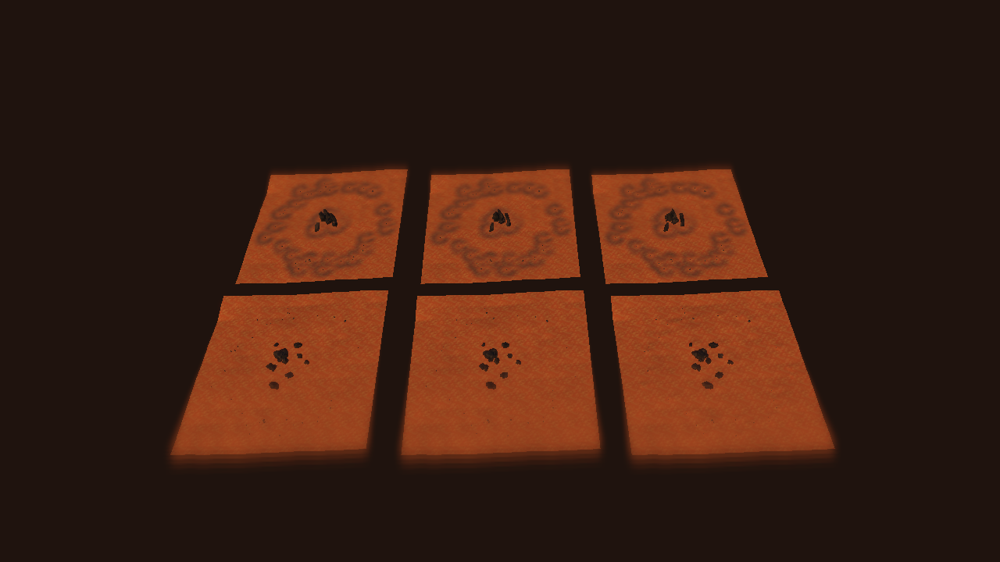

# Fixed terrain dressing study — October 9, 2026

Status: first bounded comparison delivered; appearance and Player performance remain unaccepted.

The [controlling plan](../../../Design/Gameplay/FIXED_TERRAIN_DRESSING_PLAN.md) records the approved persistent-terrain direction and experimental sequence. [Source receipt](baseline-2026-10-09.json) identifies the 24 m native-collision patch, seed, formation counts and protected hashes. [Verification](verification-2026-10-09.json) records exact candidate-source hashes, isolated test/render scope and limitations. [Focused results](focused-tests-2026-10-09.xml) report four passing EditMode tests.

## Comparison

Columns, left to right: geometry baseline on sand; shared sand/gravel field; shared field with shallow physical relief. The front row is the Scatter family; the back row is Spire. Both rows reuse the same sampled terrain patch. All treatments in a row share rock geometry/transforms and material coordinates. The original approved stage is retained within each family; seeded peripheral fragments are a simple study arrangement, not a production talus grammar.

| Family | Baseline | Shared contact | Contact plus relief |
| --- | --- | --- | --- |
| Scatter | [Image](family-0-treatment-0.png) | [Image](family-0-treatment-1.png) | [Image](family-0-treatment-2.png) |
| Spire | [Image](family-1-treatment-0.png) | [Image](family-1-treatment-1.png) | [Image](family-1-treatment-2.png) |

## Findings and next correction

The coverage treatments produce visible ground differences without modifying the native terrain. The shallow relief is geometrically present and bounded by 8 cm, but these still images do not establish a material visual advantage over contact alone. Native normals and mesh collision have focused structural proof; rock obstacle collision and traversal are not installed.

The images expose overly broad gravel halos around small fragments, an obvious peripheral ring arrangement, strong ground-texture repetition and dark rock-face readability. These are unfinished study results, not an accepted production look. Existing URP renderer effects, including blur, affect the captured presentation; no production lighting, renderer or material setting was retuned to improve the screenshots.

Next: scale contact/wake widths to each rock footprint, cluster fragments relative to parent rocks/talus sources rather than a circular perimeter, and compare a less repetitive sand treatment. Then improve exposed slab lips and mesh-derived contact where broad bounds misrepresent gaps. Keep matched geometry and source inputs so each change can be assessed independently. Author appearance acceptance precedes whole-world population.

## Validation and Editor incident

Unity 6000.4.0f1 compiled the candidate and passed 4/4 focused EditMode checks in `D:\BooterBigArmValidation\FixedTerrainDressing20261009`. The isolated copy excluded the native terrain asset tree; native-query behavior used synthetic terrain fixtures, and scene tests used the saved study meshes. This is not a fresh full Greater Wasteland terrain validation. The main production scene and sampled TerrainData SHA-256 hashes remain identical to the captured source receipt. The asset GUID scan found zero duplicate groups.

A first source-Editor test run found the exact outer-edge PhysX raycast omission. The sampler now probes just inside the same tile only for an exact border miss. Final checks cover that behavior, holes, collider-data mismatch, negative cells, enumeration-independent seam ownership, bounded wind-directed fields, matching panel inputs, missing scripts, build exclusion and shared relief collision.

The live Editor offscreen-render request stalled its main thread. Its process was neither restarted nor focused; all later tests and captures ran in the isolated copy. Subsequent captures are guarded to require batchmode. The isolated Direct3D 11 capture exited 0 and produced seven 1280 by 720 frames with no reported study-shader errors. Shader inspection/rendering is not exhaustive keyword/platform proof or Player profiling. No Play Mode or gameplay smoke test ran.

Task-owned Unity YAML/metadata trailing whitespace was normalized without changing serialization values. Incidental Greybox_BigARM material serialization was inspected and restored to its initial bytes. Packages, quality settings, enabled build scene and native terrain assets retain their existing content.
