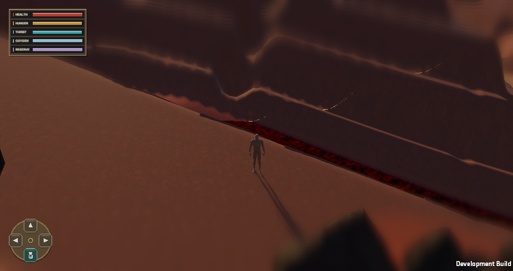
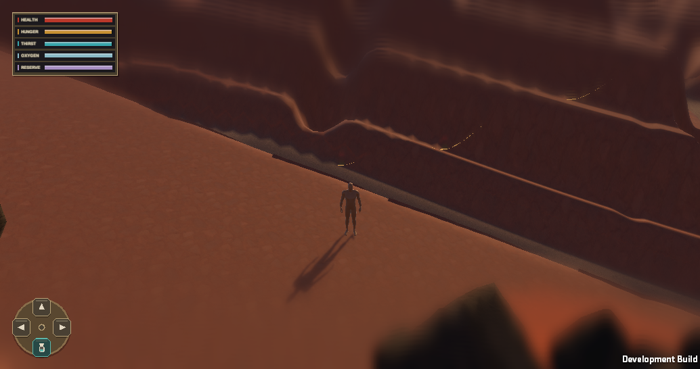
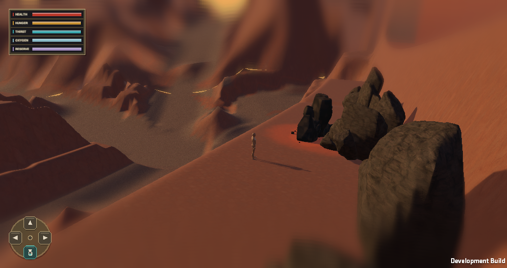
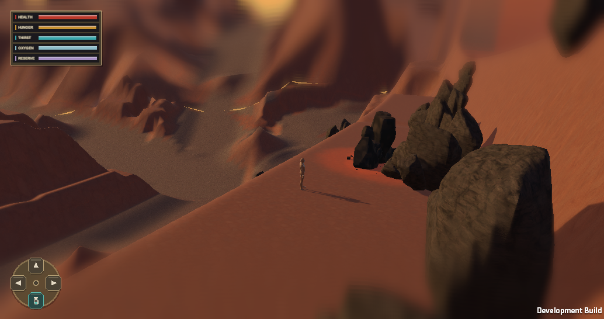

# Canyon live slice — 2026-09-29

Historical deep-canyon experiment. The user subsequently set this first prototype region to gentle Big Noise and Little Noise terrain; [the current receipt](gentle-prototype-region-2026-09-29.md) supersedes the active-state claims below.

The production Unity world now starts seed `24681357` at a walkable canyon rim near absolute `(488, 312)` with the camera facing the generated cut at yaw `270°`. This is a non-canon first slice for evaluating terrain-driven strata and Rock Workbench-derived stones. The start override applies only to that seed. Other seeds retain the existing spawn path. The sections below preserve the sequence of experiments; the final active state is described under **Overlook and source-rock wall pass**.

## Implementation and identity

- The canyon planner supports a wide major cut with smaller branch cuts. The production query excavates shelves, gullies, and a talus apron from that deterministic plan. The terrain query remains the height and semantic authority.
- The initial cliff-face pass fitted an overlay to the rendered near terrain and added source-linked Workbench buttresses and toe debris. The later overlook pass disabled that overlay after Player captures exposed contact tears. A chunk's absolute coordinates and world seed decide its stones. No persistent scene placement was added.
- The production profile turns on canyon excavation in the initial playable area and starts the representative seed at the rim. The profile and topology/material/decoration versions were advanced. Existing saved state remains on disk but a version-incompatible save is not loaded into this new topology.
- Geometry and rock objects are rebuilt from identity on chunk load. The existing unload/reload owner and collider streaming remain in control. There are no new authored reservations or runtime deltas in this slice.

## Automated and Player proof

- The isolated mirror compiled and built a macOS Development Player from the production scene. The prototype validator ran in the build path.
- Focused EditMode fixtures passed: generator 10/10, canyon planner 10/10, cliff decorator 4/4, representation compiler 5/5, and cliff section study 5/5.
- The Player reached absolute `(479.55, -3.82, 314.93)` after the safe start, with camera yaw `180°` and pitch `26°`. At 45 seconds it had 225 loaded near chunks, 49 decorated chunks, zero pending terrain or decoration, 9 streamed terrain colliders, and 426 decoration colliders. This proves initialization and completion of the local streaming queue. The settled full-content telemetry sample at 1034×546 reported 101.0 FPS, 9.90 ms mean frame time, 16.78 ms p95, 17.55 ms p99, and 49 MB managed memory. It is one static camera run, not a streaming-traverse performance acceptance.
- The screenshot below is the actual isolated Player at 45 seconds. The dark canyon wall and layered ledges render in-game. The red/black band at the rim remains after streaming completes. A diagnostic Player with fitted cliff faces disabled showed the same band, so the new face mesh is not its cause. The visual target in the supplied reference is **not yet accepted**.

## Canyon rim material and twilight iteration

The first Player capture above is the **before** view. An isolated mirror used the same production seed, scene, camera yaw `180°`, pitch `26°`, and rim stop to compare the existing material with a canyon-floor response. The floor material now reduces bright deposited sand, exposes mixed gravel and shale on steep transitions, and leaves terrain height and collision ownership alone. This removed the vivid red/black rim band in the Player. The production material version is now `3` so this response has a distinct generated representation identity.

The mirror also compared unchanged lighting, brighter ambient fill, and two sun directions. A restrained scene calibration rotates the low twilight light toward the cliff, reduces shadow strength from `0.96` to `0.82`, and modestly raises trilight ambient fill. The sun still cycles at a low elevation with long shadows, consistent with the world basis. The stronger front-lit trial washed out the wall and was not used. Lighting is global, so another region and deeper cycle phases still need visual review.

The final isolated macOS Development Player was built from assets byte-identical to the production scene, profile, and material service after this iteration. Its capture below is at absolute `(479.52, -3.82, 314.94)`, with the same yaw and pitch. At 45 seconds it reported 225 loaded near chunks, 49 decorated chunks, zero pending terrain or decoration, nine terrain colliders, and 426 decoration colliders. The last settled full-content sample at 1034×546 was 117.5 FPS, 8.51 ms average, 9.23 ms p95, 16.59 ms p99, and 57 MB managed memory. This single stationary run is a local budget observation, not a comparative performance or unload/reload claim. Final mirror EditMode results: 17/17 `WorldSurfaceMaterialTests` and `TopDown3DWorldGeneratorTests`, plus 9/9 cliff decorator and representation compiler tests, passed after the material version change. The latter cover repeatable generated faces, shared endpoints, rebase, and representation budgets; the lighting/material change does not alter terrain topology.

This is an intermediate visual pass. The wall still reads as a broad smooth mass; the reference's large-scale mesa hierarchy, exposed rock variation, middle/far strata, and distributed foreground boulders remain absent from this camera. Canyon floor and wall semantics can overlap at confluences; this material response improves the visible transition without resolving that underlying semantic case. A traversal that unloads and reloads these chunks, including frame-time and collision checks, is the next runtime proof. Hands-on Play Mode visual acceptance remains with the user.

## Overlook and source-rock wall pass

The 180° capture above faced a mostly smooth wall. A corrected synchronous Player camera sweep found the canyon overlook at yaw `270°`; an earlier asynchronous screenshot probe mislabeled angles and its conclusions were discarded. The production profile now starts the representative seed at that yaw. The first overlook capture below is the controlled view with the existing Workbench formations and no new wall rocks.

The fitted face overlay intersected the near terrain and produced thin dark tears. A same-Player comparison with that overlay suppressed removed them. The active production profile now sets `renderFittedCliffFaces: 0`; the fitted-face code is retained for future contact repair. The terrain mesh remains the visible and colliding canyon wall. Existing Workbench buttresses and toe debris continue to derive from cliff spans. This removes the fitted face colliders in the active slice, so it is a deliberate interim geometry tradeoff, not proof that the layered overlay is finished.

The new `Workbench Wall Rock` pass selects sparse steep canyon-wall samples from absolute cliff spans, chooses one of the five baked source recipes, excludes reserved sites and approaches, checks both agents' walkability and reserved routes, and places a colliding LOD rock under its owning streamed chunk. The span feature ID names each rock; the placement is static geology with no runtime save delta. A failed world query raises an error instead of silently omitting a rock. The fixed chunk `(29, 15)` contains two wall rocks in the Editor fixture. The fixture rebuilt the same box colliders after reload and origin rebase and checked wall semantics, contact range, and both agents' routes.

The final isolated macOS Development Player below used production scene, profile, and runtime assets byte-identical to the live checkout, plus a mirror-only screenshot driver. At 45 seconds, seed `24681357` was at absolute `(479.48, -3.83, 314.96)`, yaw `270°`, pitch `26°`, with 225 near chunks, 49 decorated chunks, zero pending terrain or decoration, nine terrain colliders, and 259 decoration colliders. The same seed without the wall-rock pass had 240 decoration colliders, so the pass added 19 in this settled ring. A settled full-content sample at 1034×546 reported 103.6 FPS, 9.65 ms average, 16.68 ms p95, 17.25 ms p99, and 49 MB managed memory; this is a stationary budget observation, not a causal frame-rate comparison. The final focused Editor runs passed 14/14 cliff decoration and streaming/performance tests, plus 5/5 representation tests, after the last query and route correction.

Mirror-only alternatives were rejected: more toe/rim rocks had little effect at the real camera, a broad strata shader looked painted onto the slope, and depth bias worsened face tears. The current result adds visible wall rock but remains short of the reference's large mesa hierarchy, substantial exposed strata, varied rubble fields, and distant silhouettes. It also still needs a live hands-on visual review and a moving Player route through chunk unload/reload with frame-time and collision checks.
