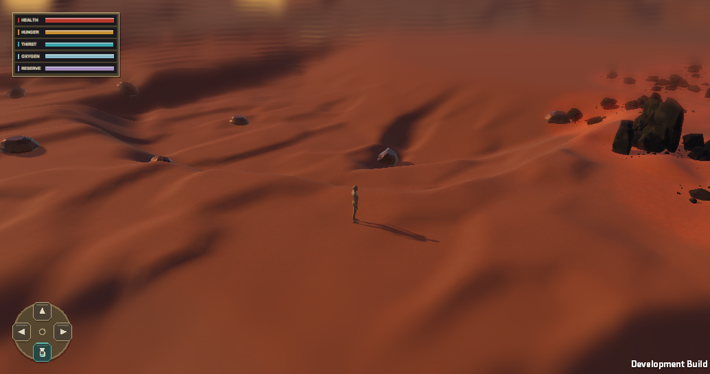

# Gentle first-region terrain — 2026-09-29

The user clarified that the first prototype region is relatively flat. The earlier deep-canyon Player captures in [the canyon live-slice receipt](canyon-live-slice-2026-09-29.md) are historical experiments, not the current target for this coordinate.

The active production profile keeps seed `24681357` and the prototype start at absolute `(488, 312)`, yaw `270°`, pitch `26°`. Within 360 m of that coordinate, the world query uses the existing Big Noise, Little Noise, fine noise, and flat-region logic. A 120 m smooth transition returns to the retained canyon query outside the first region. The terrain query still owns height, normals, semantics, near/mid/far representation, and collision. Rock Workbench recipes, chunk decoration, material response, twilight lighting, and the fitted-face contact safeguard remain in the project. Canyon wall rocks require canyon-wall semantics, so they do not spawn in the gentle core. Static terrain and decoration rebuild from seed and absolute coordinates; no persisted runtime delta was added. Topology version `15` prevents older terrain saves from being silently reused against this changed ground.

The isolated macOS Development Player below used scene, profile, and runtime source byte-identical to the live checkout, plus a mirror-only screenshot driver. At 45 seconds the player was at absolute `(486.75, 5.81, 311.87)` with 225 near chunks, 49 decorated chunks, no pending terrain or decoration, nine terrain colliders, and 420 decoration colliders. A settled full-content sample at 1034×546 reported 105.7 FPS, 9.46 ms mean frame time, 16.65 ms p95, 17.38 ms p99, and 57 MB managed memory. This is one stationary sample, not traversal performance acceptance. Focused Editor checks passed 21/21 for world generation, cliff decoration, and the unbounded query. A further fixture confirms the gentle core matches the prior canyon-disabled noise query exactly; outside the transition it matches the full canyon query.

The view has the intended much lower landform relief but still needs hands-on Play Mode assessment of routes, rock density, and visual composition. The distant canyon system and 120 m transition have query proof, not a moving Player traverse or distant visual acceptance.
