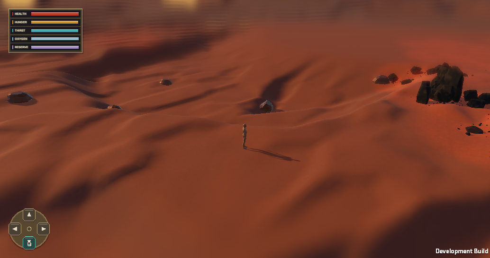

# Off-camera formation publication — 2026-09-29

The user observed Rock Workbench formations appearing directly in front of the player during chunk streaming. Decoration previously began within three 18 m chunks and natural-object roots became visible as their members were built. Terrain and generated-object identity were already deterministic; publication timing was the visual failure.

The active four-chunk decoration ring gives the planner more lead time while retaining the seven-chunk terrain ring and local terrain collision ring. A chunk now builds all decoration under an inactive root. Once complete, its renderer bounds are held until outside the game camera frustum, with a 10 m view margin, and at least 1.5 chunks clear of the player. Chunk identity, placements, saved deltas, collision ownership, unload, and rebuild inputs are unchanged. Colliders activate with the visible root, so an unpublished formation cannot act as an invisible obstacle.

At startup, a full-screen preparation cover holds the player until the central five-by-five chunk ring and central terrain collider are ready. Those nearby decorations activate together before the cover clears. After central collision is available, a 45-second decoration timeout releases the cover if some decoration cannot finish; any remaining chunks retain the off-camera rule. The controlled Player reached initial presentation readiness in 12.4 seconds.

The isolated macOS Development Player below used production scene, profile, setting, and runtime source byte-identical to the live checkout, plus a mirror-only stationary screenshot driver. At 45 seconds it had 225 loaded near chunks, 81 decorated chunks, zero pending terrain and decoration work, nine terrain colliders, and 731 decoration colliders. Eleven complete chunks were still withheld from publication because of the current view or player clearance. A settled full-content sample at 1034×546 reported 114.1 FPS, 8.76 ms average, 12.45 ms p95, 17.11 ms p99, and 57 MB managed memory. This is a stationary observation, not a moving traversal benchmark. The Player build passed the prototype validator. Focused EditMode tests passed 12/12, including inactive decoration bounds and camera/clearance publication decisions.

The earlier five-chunk trial expanded the ring to 121 decorated chunks and moved the streaming p95 slightly past the 16.67 ms diagnostic reference. The four-chunk ring settled at 81 decorated chunks within the local sample. Manual Play Mode movement and camera rotation remain the final visual check for perceived popping; the automated proof establishes the publication rule and one static Player frame, not subjective motion acceptance.
