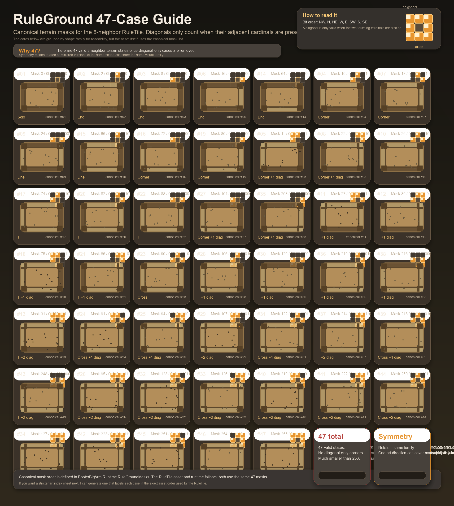

# RuleGround RuleTile Guide

## How to read it

- Bit order: `NW, N, NE, W, E, SW, S, SE`
- The RuleTile uses the canonical 47 valid terrain masks.
- A diagonal only counts when the two touching cardinals are also present.
- The cards are grouped by shape family for readability, not by binary order.

## Symmetry

A rotated or mirrored version of a tile shape is still the same family of shape. That is why the RuleTile does not need 256 unique cases.

## Source

The canonical mask list lives in `Assets/_Project/Scripts/Runtime/Prototype/RuleGroundMasks.cs`.
