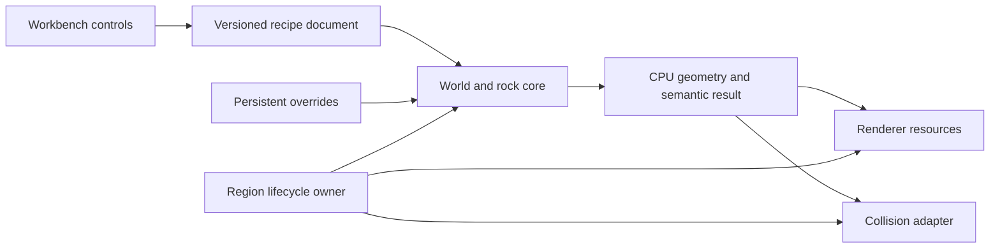

# Proposed Engine Ownership Boundaries

Ownership contract. The initial document/identity and scene/display boundaries are now implemented; see [the first-pass runtime result](./FIRST_PASS_RUNTIME.md). The broader systems below remain planned. The [requirements](./REQUIREMENTS.md) and [accepted direction](./DIRECTION.md) control scope.

Expanded 2026-09-10: [the whole-engine master plan](./FOUNDATION_PLAN.md) defines the complete runtime/application architecture and implementation packages; [the architecture research](../Research/ENGINE_ARCHITECTURE_RESEARCH.md) records library boundaries. The contracts below remain applicable to all later systems. Workbench and Game consume one runtime; fixture state must not become the permanent world model.

## Ownership

| Owner | Owns | Must not own |
|---|---|---|
| Core | IDs, resource lifetime primitives, logging, scheduling interfaces | Game canon or platform GPU objects |
| Runtime simulation | Fixed ticks, transient entities/components, transform authority and ordered commands | UI widgets as authoritative game state or permanent IDs derived from ECS indices |
| Asset catalog/cooker | Logical asset IDs, source provenance, versioned import recipes, content keys and validated payloads | Player save deltas or silently rewriting original source art |
| Platform adapter | Events, window, OS paths, device notifications | Movement rules or editable recipe state |
| Recipe document | Validated settings, version, edit history and dirty state | Live renderer/physics handles |
| World/rock core | Deterministic planning and CPU results | Window/UI access or GPU submission |
| Region lifecycle | Request epochs, cancellation, current desired state and budgets | Permanent identity derived from load order |
| Renderer | Mesh/material handles, visibility, uploads and frame passes | Authoritative world edits or physics state |
| Collision adapter | Shapes and physical/query resources | A second terrain surface that disagrees with generated data |
| Persistence | Versioned durable deltas and atomic document writes | Transient pointers, handles or every regenerable mesh |
| Workbench | Commands applied to the document, selection and diagnostics | A second recipe copy that drifts from saved data |
| Navigation and coarse travel | Agent profiles, versioned routes/tiles and detailed/coarse traversal handoff | Teleport recovery or deleting a companion when rendering unloads |
| Game systems | Interactions, finite inventory/cargo, pressure, tasks and persistent consequences | Renderer handles, raw platform input or competing save writers |
| Animation | Skeleton/clip evaluation and pose output; explicit root-motion/event ownership | Unconditionally moving physics actors independently of the motor |
| Audio and player UI | Presentation of shared state, bounded cue lifetime, settings and input focus | Duplicated inventory/task state or hidden authoritative changes |

## Critical Lifecycles

Generation request identity includes stable owner ID, recipe/generator versions and a request epoch. A completed job is accepted only if its owner and epoch are still current. Cancelling an owner prevents future adoption even when computation cannot stop immediately. GPU destruction waits for the rendering API's lifetime rules; CPU cache ownership is independent. Reopening a region reconstructs resources from authoritative data and deltas.

Worker jobs produce data; the render owner submits uploads. Initial budgets must be measured and explicit. Do not solve a burst by running unbounded generation or collision cooking on the frame thread.

Authoring edits validate before replacing the active recipe. Failed generation retains the prior valid preview with an explicit error. Later undo/redo operates on document commands, not arbitrary UI widgets. Save writes should be transactional and versioned; define migration before changing persisted meaning.

## Procedural Concerns

- World identity: explicit seed, algorithm/version namespace and replaceable coordinate authority.
- Stable object identity: stable source/member keys and placement ownership, separate from resource handles.
- Streaming: lifecycle and late-result checks above; an isolated renderer fixture is explicitly temporary.
- Authored constraints: recipe bounds, source envelopes and exclusions are inputs to generation.
- Persisted deltas: authoritative changes survive resource destruction and regeneration.

Use camera-local floating-point coordinates for rendering while keeping durable geographic identity independent. Local axis/units conventions will be documented in the first fixture; they do not canonize the world's map. Tests must separately cover projection/depth, winding and transforms across the actual backends.

## Initial Module Layout

Only create modules when needed: `Source/Core`, `Source/Platform`, `Source/Rendering`, `Source/World`, `Apps/Workbench`, `Tests`, and `Tools`. Third-party implementation stays in ignored build/cache locations, with source/version/license records tracked separately. The preparation experiment under `Research/Experiments` is disposable evidence, not the production module layout.

Add `Source/Runtime`, `Source/Assets`, `Source/Persistence`, `Source/Physics`, `Source/Animation`, `Source/Navigation`, `Source/Audio`, `Source/UI`, `Source/Game` and `Apps/Game` at their first actual consumer as ordered by the master plan. These are planned ownership boundaries, not instructions to scaffold every empty module now.
