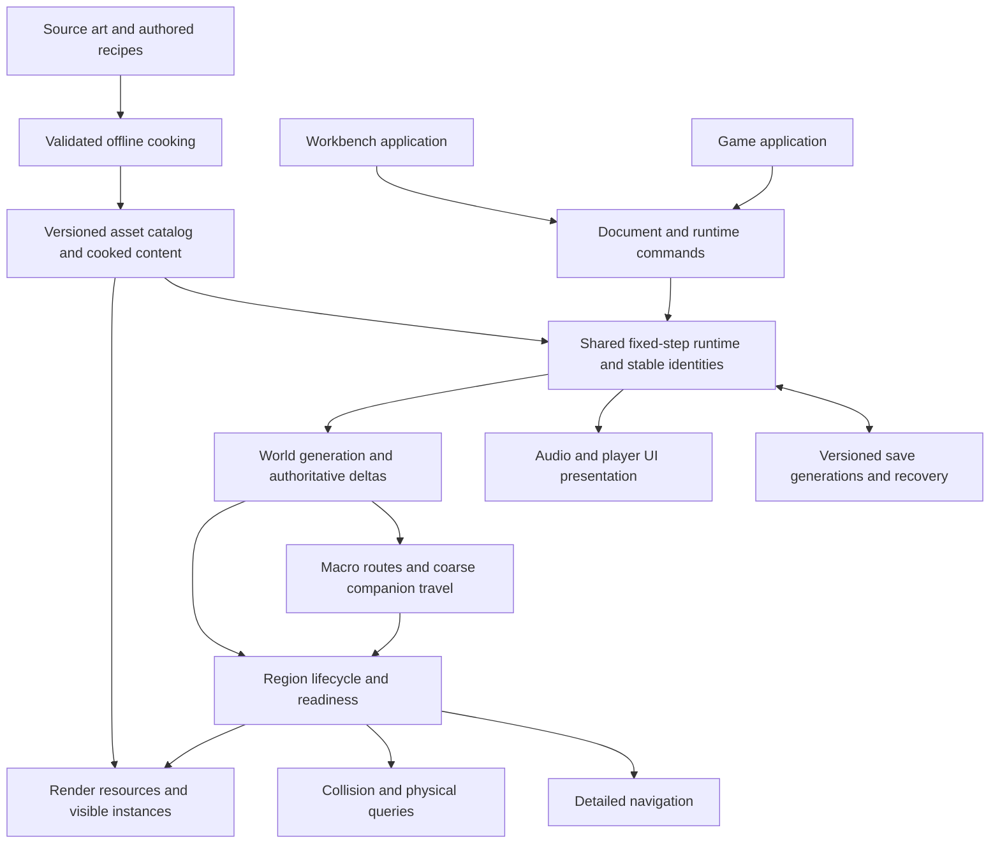

# Engine Master Implementation Plan

Revision 2, rewritten 2026-09-10 after the requested whole-engine analysis and [V1 audit](./ENGINE_PLAN_AUDIT.md). This is the primary implementation roadmap for Engine. It supersedes the earlier foundation plan that ended at streamed terrain. [Direction](./DIRECTION.md) controls product intent; [STATUS.md](./STATUS.md) controls current implementation/evidence. The [system audit](../Research/ENGINE_SYSTEM_AUDIT.md), [research update](../Research/ENGINE_ARCHITECTURE_RESEARCH.md) and [work-package record](./ENGINE_ROADMAP.json) support this plan.

## Current execution target

The user's 2026-09-10 clarification is a **base engine skeleton**: connected, minimal working systems before subsystem depth or polish. Implement one supported path per required capability, verify that path once, and proceed to integration. Fix actual failures; defer optional source formats, stress campaigns, advanced visuals and production tooling. The production/gameplay milestones below remain the future roadmap and do not expand the immediate skeleton acceptance target. [Direction](./DIRECTION.md) controls this depth limit.

The first user-facing milestone is the completed native rock generator, clarified during P18/P19. P14–P17 implement its core loop, and the [runnable package/handoff](./ROCK_GENERATOR_MILESTONE.md) is now delivered. P20 live streaming follows. This delivery priority does not remove remaining engine systems from the roadmap.

## 1. What we are building

A game-specific C++ engine for regular third-person Booter & BigARM: readable open wasteland, generated terrain and rocks, grounded traversal, a physically persistent companion, durable player consequences, useful content tools and a Windows player build. Mac remains the daily development platform while practical. Canyons are deferred.

We own the systems that make this game distinctive and coherent: world identity, generation/placement rules, runtime ownership, asset/material semantics, streaming policy, authoring, gameplay and persistence. We integrate established libraries for rendering access, collision, animation sampling, navigation meshes, audio and UI. The [research table](../Research/ENGINE_ARCHITECTURE_RESEARCH.md) records the preferred choices and integration checks. Existing selected pins remain unchanged until a consuming implementation batch requires a new dependency.

“Engine ready” has three useful levels:

- **Foundation ready:** reusable outdoor renderer/assets, character-scale collision and animation, shared workbench/player runtime, native rock authoring and a relocatable technical package.
- **Game slice ready:** one coherent expedition through streamed open terrain, with salvage/pressure/cargo, a complementary BigARM action, physical regroup and durable changes after restart.
- **Production engine ready:** representative content can be authored, validated, profiled, saved/recovered and packaged on declared Windows hardware, with bounded resources and support diagnostics. Final game content and release approval are additional requirements.

The engine grows through these representative workloads. Completing every future renderer/editor feature is not a prerequisite for testing movement, companion behavior or the first expedition.

## 2. Current baseline and scope

At this plan’s original audit, M0 was the native fixture and research baseline: C++20/CMake/SDL3/bgfx/bimg/bx/ImGui, Metal fixture, inspector, OR-1 geometry proof, transferred rock/ground sources and texture research. D3D11 code exists but native Windows proof is pending. That historical audit preceded implementation. Shared runtime, physics, animation and other completed packages are now tracked in [STATUS.md](./STATUS.md); use that live handoff rather than this original baseline for current capability claims.

The 24 capability rows in [the audit](../Research/ENGINE_SYSTEM_AUDIT.md) are the complete current coverage checklist. The native work remains inside Engine; preserved Unity and Arc & Dust are references. Old top-down/2D/canyon assumptions do not carry over. Infinite-world language means procedural continuity with bounded active residency and checked coordinate ranges, not an infinitely allocated world.

This document authorizes no release, purchase, account change, destructive cleanup or external publication by itself. Routine engineering decisions and work sequencing are the agent's responsibility under the user's continuing task authority. Final creative choices remain the user's.

Implementation sequencing clarification, 2026-09-10: P15's CPU recipe/geometry path consumes core documents and P14 placement contracts, not workbench edit commands. P06 is therefore a direct prerequisite of P17's live authoring loop instead of P15. P06 remains required and will be integrated with the workbench batch; no command, save/reload or UI requirement is removed. This keeps UI work from blocking independent CPU generation while preserving the final integration gate.

## 3. Architecture and invariants

One shared runtime serves Workbench and `Apps/Game`. Extract services from the fixture when needed by real consumers. Editor document commands, game commands and simulation state remain distinct. Keep the existing fixture as a diagnostic client of shared rendering APIs, not a second material or physics implementation.

| Contract | Decision to implement | Failure prevented |
|---|---|---|
| Time | Fixed simulation ticks, bounded catch-up, explicit pause behavior; presentation interpolation separate. Start at configurable 60 Hz as a technical default, not a promised frame rate. | Frame-rate-dependent gameplay, unbounded catch-up and inconsistent coarse travel |
| Identity | Stable world/object/material/asset IDs separate from ECS indices and renderer/physics/nav handles. Canonical integer generation inputs; exact ID tests. | Save changes attached to the wrong regenerated object |
| Coordinates | Integer region addresses plus local high-precision values; nearby render/physics coordinates; checked negative boundaries and overflow. Region span is versioned technical data. | Precision loss, chunk seams and accidental final-map canon |
| Authority | Simulation owner applies commands; callbacks/jobs produce bounded messages/data; deliberate ordering for authoritative effects. | Races and callbacks that mutate half-updated worlds |
| Surfaces | Versioned generation result feeds render, collision and navigation adapters with agreed material/traversability metadata. | Visible safe ground whose collider or nav data describes another version |
| Residency | Separate desired, CPU-ready, render-ready, collision-ready, nav-ready and retiring states; generation epochs on adoption. | Walking into unavailable terrain or resurrecting unloaded resources |
| Persistence | Authored config, generated base, mutable deltas and disposable caches have separate owners/versions. | Cache rebuild erasing player changes |
| Companion | One detailed/coarse mode advances BigARM; authoritative route/position survives invisibility and restart; invalid re-entry holds/replans. | Teleport or duplicated movement/cargo during handoff |
| Assets | One catalog and shared resource owner; source bytes preserved; versioned semantic cooks and atomic publication. | Duplicate loading, stale reloads, color/channel corruption |
| Presentation | Scene color is linear until a single display conversion; input, UI/audio and effects consume state instead of inventing game truth. | Double gamma, UI-owned inventory and event duplication |

The initial gameplay model is local single-player simulation; multiplayer remains deferred and is not promised by these interfaces. Authoritative procedural IDs do not require bit-identical physics replay across CPUs. Record and test each determinism claim separately.

## 4. Milestones and integrated outcomes

Each milestone comprises several coherent implementation packages, not a request for the user to choose every subsystem. Detailed package IDs below identify dependencies and proof. Phases may overlap where the dependency graph permits it; integration remains sequential in a shared checkout.

| Milestone | Integrated outcome | Exit condition |
|---|---|---|
| M1 — Reusable outdoor foundation | Core document/asset identities, correct color, useful sun/shadows, texture/material loading, ambient light, saved inspection settings, shared resource diagnostics and build/path conventions | P01–P07 pass their relevant CPU/GPU/document checks. W01 supplies native Windows build evidence; otherwise explicitly label the platform part pending. No rock-generation completion claim. |
| M2 — Traversable character calibration | Shared game runtime, fixed tick/actions/entities, Jolt collision, third-person motor/camera, imported animated proxy, one audio cue, minimal snapshot/restart and portable technical player | P08–P13 pass technical checks, including obstruction, input lifecycle, skinning, resource cleanup and restart. W02 tests the actual Windows path. User reviews feel separately. |
| M3 — Native rock authoring | Versioned recipe documents, deterministic CPU generation, shared material/mesh/LOD/collision outputs, all-side character-scale inspection and undo/save/reload | P14–P17 pass recipe, identity, geometry, visual diagnostic and bounded regeneration checks. Artistic acceptance remains distinct. |
| M4 — Persistent streamed open space | Procedural terrain/placement constrained by macro routes, asynchronous bounded generation, coherent render/collision/nav readiness, persistent deltas and recovery | P18–P22 demonstrate borders, negative/large coordinates, cancellation, repeated unload/reload, no resource growth, save interruption recovery and traversal-safe readiness. |
| M5 — Physical companion expedition support | Local and coarse navigation, BigARM separation/regroup, stable task/cargo state, interactions, meaningful UI/audio and one complementary action | P23–P27 demonstrate no teleport, single-writer handoff, valid detailed re-entry, transaction-safe cargo and complete cue/UI lifetime. |
| M6 — First integrated survival expedition | One pressure mechanic, salvage/cargo tradeoff, one threat and crafting/complementary action, with durable consequences | P28–P30 provide the scoped outbound/scout/salvage/regroup/return loop. Technical state checks pass; the user decides whether the experience is worth expanding. |
| M7 — Production content and measured scale | Practical content authoring, landmarks/constraints, required visual quality, character/audio polish, accessibility/localization and measured performance tiers | P31–P34 meet a declared representative workload and content pipeline. Windows tuning depends on W02 and a recorded hardware/quality profile. |
| M8 — Supported Windows candidate | Relocatable package, stable saves/migrations, recovery and support diagnostics, notices, symbols and exact candidate verification | P35–P37 and W03 pass on declared Windows hardware. Release/publication remains a separate user decision. |

Historical P0/P1/F1/F2 preparation and fixture receipts remain linked from [STATUS.md](./STATUS.md). Historical F3 maps to M3; F4 expands into M4/M5. OR-1 is complete as previously recorded. OR-2–OR-5 and T1–T5 remain detailed proof contracts, mapped below; they do not compete with this program schedule.

## 5. Work packages

Owned locations in this table are **planned modules under Engine**, not claims that files exist. Build only the module needed by its first consumer. Each package's exact dependencies/capability IDs are indexed in [ENGINE_ROADMAP.json](./ENGINE_ROADMAP.json).

| ID | Deliverable and owner | Evidence needed to close |
|---|---|---|
| P01 | `Source/Core`, `Source/Assets`, `Source/Persistence`: minimal shared runtime shell; units/identity/version conventions; bounded JSON documents; configuration and source/cooked path policy | Core builds independently of UI; ID/negative-coordinate/serialization cases; invalid documents retain prior state; atomic document replacement. No general reflection framework. |
| P02 | `Source/Rendering`, `Shaders`: OR-2 linear/HDR/display and UI composition boundary | Known color values through actual GPU path, no double conversion, resize and diagnostic mode checks. Use current rendering code as the shared path. |
| P03 | `Tools`, `Source/Assets`, `Source/Rendering`: T1/T2 semantic texture cooking, catalog records and validated shared GPU residency | Independent mip/channel/normal/NPOT oracles, source preservation, malformed/oversized input rejection, sharing/reload/final release and byte accounting. Start uncompressed KTX 1. |
| P04 | `Source/Rendering`, `Shaders`: one bounded directional shadow pass, filters/bias and debug view (OR-3) | Cast/self shadows, moving light/camera, bias/edge tests and resource recreation. Keep scene lighting semantics from P02. |
| P05 | `Source/Rendering`, `Source/Assets`: first opaque PBR material and ambient/environment contribution (OR-4/T3) | One real rock binding set and one ground material; channel isolation, asymmetric normals and known material response under recorded exposure. No whole-library port. |
| P06 | `Apps/Workbench`, document services: saved inspection presets, command-based edits and required inspector texture support (OR-5) | Save/reload/error cases, shared live state, UI capture intact, known view reproduction and resource cleanup. Custom atlas/thumbnail behavior tested if introduced. |
| P07 | `CMake`, `Tools`, platform adapter: build/test presets, install-relative asset paths, compiler diagnostics and build identity | Fresh configured build, arbitrary working-directory launch, missing-asset diagnostics and receipt/source binding. Source cache is not runtime package content. |
| P08 | `Source/Runtime`, `Source/Platform`: fixed ticks, EnTT-backed transient storage, transforms and gameplay/UI/system action contexts | Bounded catch-up, pause/focus/disconnect, remapping/held-input transitions, create/remove/stale entity and ordered-command checks. Gameplay state never stored in UI widgets. |
| P09 | `Source/Physics`: Jolt adapter, static mesh/heightfield/capsule representation, filters and queries | Bounded physics integration fixture, body lifetime/callback ordering, overlap/raycast/sweep and query policy for CharacterVirtual. Physics handles never persist as IDs. |
| P10 | `Source/Game`, camera module: capsule motor and regular third-person follow/orbit/obstruction behavior | Slopes/steps/ground loss/blocked-camera cases and frame-rate-independent command results. Physical-controller and feel review remain user-owned. |
| P11 | `Tools`, `Source/Assets`, `Source/Animation`, `Source/Rendering`: restricted glTF/GLB mesh/skin import, ozz sampling/blending and GPU skinning | Legal technical proxy, transform/units/UV/tangent/skin fixtures, missing joints/unsupported-extension rejection, clip bounds and resource unload. Motor owns locomotion; root motion is opt-in and explicit. |
| P12 | `Apps/Game` and shared runtime: animated traversable calibration space, debug interaction target, minimal presentation and one miniaudio cue | Both apps use the same world/resources; no ImGui dependency required by player; cue/event delivery once; animation/motor integration and clean shutdown. No final-art claim. |
| P13 | Persistence/build tools: minimal player/world snapshot, last-good recovery and relocatable technical game package | Restart restores proxy/world identity; interrupted/corrupt snapshot handled explicitly; package launches away from source/build checkout with only runtime assets. |
| P14 | `Source/World`: authored constraints, two agent traversal profiles, route/exclusion and stable placement contracts | Constraint serialization and deterministic agent-specific clearance rules; placement cannot erase reserved routes. Uses technical dimensions, not final geographic canon. |
| P15 | `Source/World/Rocks`: versioned recipe → deterministic CPU geometry/semantic result | Repeated seeds/edits/order, exact stable IDs, declared mesh tolerances, valid winding/normals/nondegenerate output, useful invalid-recipe errors. |
| P16 | Mesh/physics/material adapters: indexed rock assets, shared LOD chain and collision representation; meshoptimizer evaluation | All-side/near/far silhouette comparisons, seams and collision agreement, triangle/memory/rebuild measurements; keep last valid preview on failure. |
| P17 | Workbench: native rock document editor, undo/redo, save/reload and compare presets | Commands round-trip through the same generator/runtime; input restoration and repeated regeneration return resources to baseline. Walkable proxy can inspect actual rock output. |
| P18 | `Source/World`: open-ground terrain patches, macro route skeleton and deterministic rock/landmark placement | Shared border samples, negative coordinates, stable placement ownership, authored exclusions and both traversal classes. Surface interface permits future non-heightfield geometry. |
| P19 | Core/resource services: bounded job queues, cancellation/epochs, CPU staging/cache and render-upload admission | Slow/out-of-order/cancelled jobs cannot publish to stale owners; finite queued bytes and shutdown drain; no worker-thread GPU calls. Coordinate worker counts with physics. |
| P20 | `Source/World/Streaming`: desired/readiness/residency/retirement state and multi-anchor priority; frustum culling and shared instance submission | Render, collider and nav-version readiness traced separately; visibility bounds, hysteresis/border crossing, missing detail, shared asset references and priority inversion checks. Safe waiting rather than entering absent collision. |
| P21 | Persistence/world: region deltas/tombstones, consistent save generations and content/generator version gates | Edit/deplete/unload/reload/restart; interrupted multi-file save; old/new version policy; cargo/entity changes never half-commit or vanish after cache rebuild. |
| P22 | Shared integration fixture and tools: representative streamed traversal corpus | Repeated routes, large/negative coordinates, origin shifts, rapid turnarounds, no unbounded memory/collision growth in implemented adapters; recorded p50/p95/p99 stage costs. Real nav-tile stress follows P23. |
| P23 | `Source/Navigation`: Recast/Detour detailed tiles per agent profile | Border links, obstacle/routing changes, tile lifetime/version mismatch and two agent sizes. Local route validity tied to generated surface version. |
| P24 | `Source/Game`, world travel: persistent BigARM tasks/routes and detailed/coarse mode transitions | True position/speed continuity, single owner advances time, cancellation/re-entry/save cases; invalid detail holds/replans. No distance, stuck or save recovery teleport. |
| P25 | `Source/Game`: interaction commands, salvage/depletion and finite inventory/cargo transfers | Stable target IDs, range/presence checks, transaction identity, duplicate command rejection and restart consistency. BigARM cargo is never remote storage. |
| P26 | Player UI/audio adapters: RmlUi HUD/settings and miniaudio buses/positional cue catalog | Gameplay/UI action arbitration, controller focus, text IDs, volume and cue limits, unload/device-loss handling, readable prompts and no event duplication. |
| P27 | Game integration: one complementary Booter/BigARM action with physical separation/regroup | Action/cargo/task state survives stream/simulation handoff and restart; readable wait/failure state; user reviews partnership usefulness. |
| P28 | Game data/rules: one configurable pressure, carry tradeoff and limited crafting/recovery action | Fixed-time accumulation, pause policy, item conservation, recipe validation and persistence. Use neutral internal resource IDs until content terminology is resolved. |
| P29 | Game/world systems: one threat/encounter, perception/task state, hit/damage/death and animation/audio events | Spawn/death ownership across unload, deterministic command order, attack timing/hit filters, no duplicate rewards/events after reload. No broad combat framework. |
| P30 | Integrated expedition slice and evidence | One bounded outbound/scout/salvage/regroup/return workload with consequences and save recovery. Agent runs focused technical checks; user owns hands-on feel and creative acceptance. |
| P31 | Workbench/content tools: asset browser, archetype documents, placement/landmark constraints and validators | Author/edit/import a representative content set without code edits; undo and stable IDs; shared runtime previews; version/compatibility errors remain actionable. |
| P32 | Renderer/animation/effects: justified visual maturity for the representative world | Stable larger-area shadows, sky/fog/dust, limited particles/decals, normal/roughness quality, LOD/material repetition and required animation contact polish. Add advanced AA/occlusion only against a measured defect. |
| P33 | Player-facing quality: accessibility, settings and localization/audio completion | Rebinding, sensitivity/invert and motion settings, scalable legible text, captions/subtitles when cues convey information, color-independent signals, device changes and non-ASCII text. Actual language/content set remains a product choice. |
| P34 | Tools/runtime: representative budget tuning and quality tiers | Supported Windows workload/profile, attributable CPU/GPU/memory/IO tails, optimized bottleneck and regression checks; texture compression gates compare uncompressed references. No arbitrary Mac-to-PC FPS extrapolation. |
| P35 | Packaging/platform: install/update layout, settings/save location, logs/crash diagnostics and symbol archive | Clean supported Windows environment, missing/corrupt asset behavior, writable-path constraints, upgrade/rollback handling and diagnostic reproduction. No upload of user data by default. |
| P36 | Persistence/content release process: supported save/schema migration and content version compatibility | At least one old-version migration, interrupted upgrade recovery, last-good retention, incompatible-save messaging and no automatic destructive reset. |
| P37 | Exact Windows candidate and engine handoff | Clean source-to-package reconstruction, required gates/known issues/notices, representative technical checks and evidence bound to candidate. Release/store operations wait for explicit authority. |

### Native Windows gates

P20 introduces the navigation-readiness contract before the actual tile adapter exists. Player-controlled traversal requires collision readiness, not an invented nav result. Mark navigation unavailable/not-required for that workload; P23 supplies real tile readiness and its tests before AI navigation can consume it. Multi-anchor tests in M4 may use declared technical anchor positions; they do not prove BigARM behavior. P24/P27 close that integration later.

| Gate | Earliest point | Required evidence / effect |
|---|---|---|
| W01 | After P07, during M1 | Native compiler/shader build and portable fixture launch. Record architecture, compiler/backend and runtime dependencies. M1 cannot claim full Windows completion without it. |
| W02 | After P05/P10/P12 | Actual D3D11 color/normal/shadow/skin/input/resource checks on a Windows GPU and physical input devices. Gates Windows-specific tuning and candidate validation. |
| W03 | After P34/P35/P36 | Declared minimum/recommended target profiles, representative workloads, package/upgrade/save recovery and candidate-specific evidence. Gates P37. |

If Windows access is not yet available, record the unmet gate once and continue independent Mac/CPU work. Do not mark platform-dependent milestones complete, change the product target or silently create a custom compatibility fork. Revisit access when the next dependent work is reached. A hosted build without a GPU may satisfy compilation portions only.

## 6. Engineering defaults and budgets

These are provisional implementation guardrails, not approved game scale or target-PC guarantees. Store them as configurable test profiles, record actual device/resolution and change them when evidence warrants it.

| Area | Initial guardrail | Required measurement / upgrade rule |
|---|---|---|
| Simulation | 60 Hz fixed tick; maximum four catch-up ticks per displayed frame, with overload recorded. Pause policy explicitly owned. | Never simulate an unbounded backlog. Report clamped/overloaded time; coarse travel/pressure use simulation time rather than hidden wall-clock catch-up. |
| Texture fixture | 256 MiB resident texture payload, 64 MiB CPU upload staging, 8 MiB new texture upload admission per frame | Fits a bounded selected subset, not permission to preload everything. Include mesh/collision/nav allocations separately; actual GPU completion may take longer. |
| Background work | Start with at most four CPU workers, shared budget with physics, at most 32 queued generation requests and 128 MiB staged generated data | Coalesce superseded requests; backpressure producers; prioritize collision safety and visible anchors; never grow queues to hide latency. |
| Streaming | Separate priorities around Booter, BigARM and necessary route corridor; bounded active regions and unload hysteresis | Calibrate region count/span using recorded generation/physics/nav costs. Evict presentation detail before losing authoritative task state. |
| Representative rendering | Begin measurements at a recorded 1920×1080 profile; capture CPU/GPU p50/p95/p99, upload/cook stalls, resource high-water marks and post-unload baseline | This is a comparison workload, not a 60 FPS product commitment. Declare hardware/frame-time/quality targets before P34 pass/fail tuning. |
| Technical corpus | At least 32 declared generation seeds including negative/border/large-coordinate cases; 100 repeated load/unload or replacement cycles; controlled out-of-order and failure injections | Fixed inputs make regressions inspectable. Increase workloads when a specific missed failure or new scale requires it. No gameplay smoke tests are implied. |

If a limit is exceeded, report the specific bottleneck and choose bounded degradation: reduce pending detail, retain a valid prior asset, delay unsafe entry or lower optional visual quality. Do not discard authoritative deltas, duplicate an action or teleport a companion to stay within budget. Disk IO/cooking/physics creation must have timing and byte metrics, not only average frame interval.

A single valid asset larger than the per-frame upload allowance must not starve forever: stage it across bounded levels/chunks where supported, or record an explicit one-item admission exception within the hard staging/residency limits. Reject jobs whose minimum required allocation exceeds a hard limit before starting them. Platform support and measured cost determine the choice; never silently raise every budget.

## 7. Acceptance, scope and decisions

For each package: define the exact changed paths and failure cases, verify prerequisite evidence, implement the smallest coherent production path, run relevant tests, inspect outputs, update status/roadmap and commit only owned files. A passing build is not visual or gameplay proof. Avoid making a second plan every time a function is needed. Re-audit at milestone exit or when an invariant/new direction changes dependencies.

The agent owns library integration details, module organization, tests, default tuning for fixtures, bounded experiments, technical sequencing and documentation. Resolve ordinary implementation choices and proceed. Ask only when a consequential input cannot be inferred: final controls/feel or art acceptance; target-PC and quality commitments; selected first-loop content where it changes rules; unresolved canon; purchases/account operations; destructive changes or external publication. Ask with a concrete result or clear tradeoff and continue independent work. No question is required to start M1.

Game content is data-driven initially, with explicit C++ systems. Do not create a generic scripting VM or copy every Unity system. A skeleton/clip/audio/font source must have recorded provenance before import. Generated proxy assets establish infrastructure, not accepted Booter/BigARM designs. Product review can limit expansion of the affected gameplay/art lane without blocking unrelated infrastructure fixes.

### Deferred capabilities and review triggers

| Capability | Why deferred / when to revisit |
|---|---|
| Canyons and final geography | User deferred them. Preserve non-heightfield surface/route interfaces; start only with later creative scope. |
| Multiplayer/replication/rollback | No current requirement. Revisit before designing an actual network game; current state boundaries are not a compatibility guarantee. |
| Oceans/rain/water simulation | Conflicts with current setting needs; no generic “engine completeness” requirement. |
| Vehicles, mobile bases and remote BigARM storage | Not the current companion design. Do not build by analogy with other survival games. |
| Ray tracing, virtualized geometry/textures, bindless and complex render graph | Add only if a declared content/workload cannot meet quality/budget with the simpler measured path. |
| General destruction, cloth/soft bodies and advanced IK | Build the specific interaction/animation capability only when accepted content requires it. Save/identity impacts must be planned first. |
| Full material graph, general scene editor and scripting language | Grow targeted data tools only when recurring authoring limitations justify them. |
| Store SDKs, cloud saves, telemetry services and mod support | Product/distribution choices with separate integration/authority; local diagnostics and recoverable saves come first. |

## 8. Continuation policy

At each continuation read current status and run `python3 Tools/check_engine_plan.py` from Engine. It reports the earliest planned work whose indexed dependencies are complete. During M1, begin P01 and then P02; bring P07 forward once P01 is ready, and develop texture cooking after the color contract without waiting for unrelated shadow work. Integrate P03/P04 into P05 and close the outdoor foundation through P06. This replaces a renderer-only sequence with coordinated runtime/assets/build work while retaining the original color/shadow/material proof.

Keep at most one coupled implementation batch active in the shared checkout. Do not infer permission to spawn background tasks or create automations from this roadmap. At a stopping boundary, leave the exact next ready package and any blocked gate in STATUS; the user should not have to discover engine requirements or choose the next technical subsystem.

A package is complete only with its recorded proof; the checker validates structure and evidence references, not the truth of runtime claims. The [V1 audit](./ENGINE_PLAN_AUDIT.md) and retained draft show why this rewrite changed the sequence. Future changes should amend this plan and its derived index rather than creating competing master roadmaps.
