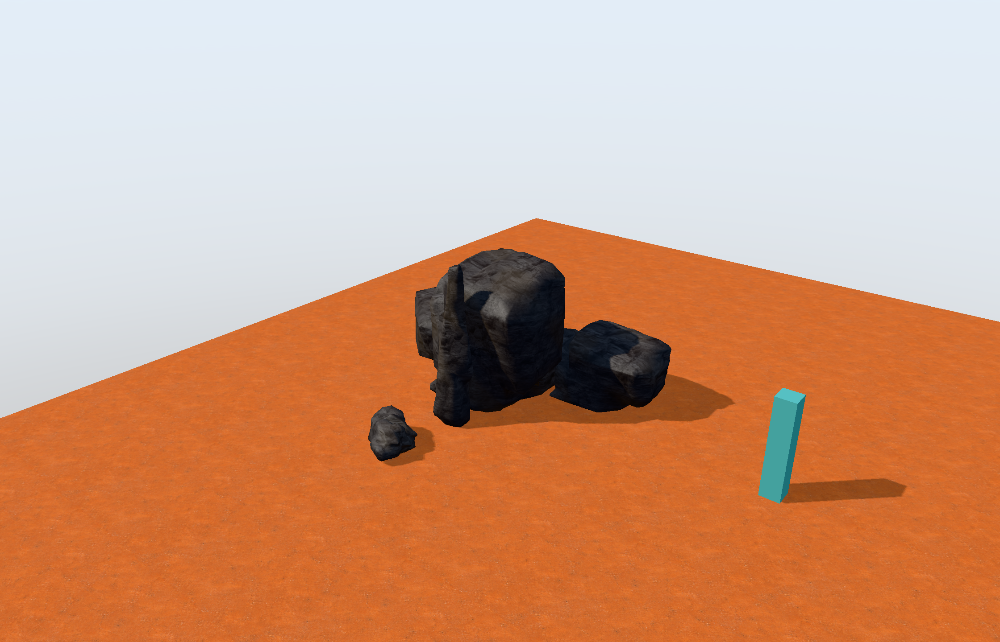

# Sky, sun and display first pass

2026-09-11. L1 of the [lighting plan](./OUTDOOR_LIGHTING_IMPLEMENTATION_PLAN.md) is implemented on Mac. The workbench now has a camera-correct sky gradient and sun glow, adjustable sun elevation/color, ambient colors shared with the sky, and PBR Neutral SDR tone mapping. This gives rock/material inspection a consistent environment and compresses bright highlights before display conversion.

Open [the updated rock workbench](../out/rock-workbench-lighting/Launch-Rock-Generator.command). It contains the six v5 rock/formation presets and starts with the braced outcrop. Its UserData is separate from earlier packages. Open **Engine → Sky and environment** for the new controls; Exposure and Ambient fill retain their existing controls. Save/reload through Inspection document, or close normally to save the launcher's inspection file.



## Implementation

- [EnvironmentSettings](../Source/Core/EnvironmentSettings.h) is renderer-independent presentation data. Inspection documents contain a versioned environment block; older documents receive explicit defaults. Validation rejects malformed/unsupported values before replacing live settings. Existing inspection undo/redo includes the new fields.
- Sun elevation controls both surface light and the existing shadow projection. The sky reconstructs world directions from the current camera, and its glow uses that same sun direction. The sky draws before geometry with no depth writes and uses no new texture slots or full-size render targets.
- Sky zenith/horizon and ground colors also drive approximate diffuse ambient fill. Colors are linear RGB; intensity remains relative. This is an authored approximation, not atmospheric scattering, GI or specular IBL.
- The display order is linear HDR → fixed exposure → PBR Neutral → sRGB → inspector. Normal diagnostics bypass exposure/tone mapping. Calibration and texture previews bypass tone mapping so reference values retain their meaning.
- The [pinned tone-mapping record](../Research/tone-mapping-lock.json) retains the exact Khronos revision and source hash. The shader function is unchanged apart from attribution/filename; its Apache-2.0 license is retained and installed into packages.

No seed, generator version, stable rock ID, world delta, collision or streaming rule changed. Environment settings remain inspection data. Windows/D3D11 execution, wider shadow coverage, scene AO, contact shadows and fog are still pending.

## Verification and limits

[Consolidated result](../Evidence/L1-result/result.json): native workbench/player and Metal shaders build; the document tests pass for roundtrip, legacy defaults and malformed environment rejection without live-state replacement. [Existing camera/state checks](../Evidence/L1-state/result.json) also pass. The build still reports an existing indentation warning in `BoundedJobs.h`; no unrelated repair was made.

The [12-state Metal comparison](../Evidence/L1-environment/result.json), at 2240×1440 drawable pixels, demonstrates sky visibility/color and sun-elevation changes. In the bright fixture, sampled near-clipped pixels fell from 87,250 to 73,570 with tone mapping enabled. Normal diagnostics, calibration colors and texture previews had zero changed sampled pixels across their bypass comparisons. The bright case is intentionally overexposed, not the recommended viewing preset. This comparison measures pixels, not GPU performance.

The [packaged launcher run](../Evidence/L1-package-run/result.json) opened the installed executable, loaded the new inspection preset and v5 outcrop with original textures, and produced the [rock capture/export receipt](../Evidence/L1-packaged-rock/result.json) without GPU errors. Baseline, bright-tone and packaged-rock captures were visually inspected; the remaining comparisons were checked numerically. Physical mouse/keyboard feel, final art acceptance and Windows proof remain user/platform work.

## Reproduce

From Engine, using the existing dependency setup and a new output destination:

```sh
cmake --build build/foundation --target engine_workbench engine_player engine_core_tests engine_state_tests --parallel 4
ctest --test-dir build/foundation -R 'runtime_documents_identity|foundation_state' --output-on-failure
python3 Tools/verify_environment.py --catalog out/surfaces-accepted-a/catalog.json --out Evidence/L1-environment-new
python3 Tools/package_workbench.py --build build/foundation --out out/rock-workbench-lighting-new --catalog out/surfaces-accepted-a/catalog.json --rock Assets/AuthoringRockPresets/05-Braced-Outcrop.json --rock-library Assets/AuthoringRockPresets --inspection Assets/Inspection/outdoor-rock-lighting.json
```

The cooked catalog remains a local prerequisite; [texture cooking instructions](../SOPs/COOK_AND_VERIFY_TEXTURES.md) reproduce it when the cache is absent. Packages and build output are ignored; source, presets, license, commands and evidence are durable.

Next is L2: two stable shadow cascades and appropriate caster coverage. L1 improves display and environment coherence; it does not complete the broader outdoor-lighting plan or P32.
