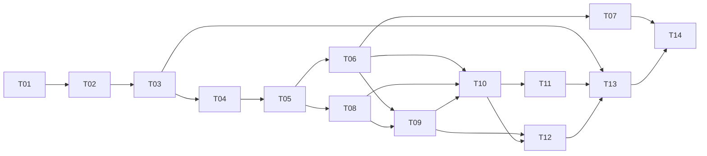

# Procedural terrain implementation plan

Created and audited 2026-09-15 from the
[professional terrain research](../Research/PROCEDURAL_TERRAIN_ARCHITECTURE_RESEARCH.md).
This is the controlling plan for the next terrain program. It extends the whole-engine roadmap;
it does not claim these systems are implemented.

## Done definition

The first production terrain foundation is done when the engine can deterministically generate,
stream, render, collide with, query and navigate a representative landscape corpus containing
open earth, sand, shale, hills, fossil drainage cuts, cliffs and one bounded canyon-wall/overhang
feature, while preserving authored constraints and stable runtime deltas.

Completion requires:

- no border cracks or material/fossil-drainage discontinuities above recorded tolerances;
- smooth measured LOD transitions from ground-level and distant views;
- matching render, collision and navigation surface revisions;
- field-driven terrain materials and geologically constrained rocks/formations;
- bounded memory, jobs, uploads and regeneration;
- unload/reload/restart determinism and stable feature IDs;
- structured AI authoring operations for inspection, constraints, regeneration and validation;
- retained technical diagnostics plus user visual acceptance of representative captures;
- native Windows performance proof remains a separate required target gate when hardware is
  available.

This does not require a finished game world, final biome canon, every canyon type, dynamic
terrain destruction, full-world voxels, a visual node editor or a permanent landscape bake.

## Sequence

### T01 — Terrain contracts and representative corpus

Define `WorldTerrainManifest`, source-field and derived-product revisions, tile/supertile/halo
addressing, feature IDs, constraint composition, ancient-formation/dry-age phase metadata and
the persistent-storm forcing revision consumed from the world simulation. Define sparse,
stable terrain-change event/delta results; terrain does not own storm scheduling or the world
clock. Add a small corpus: open plain, rolling hills, fossil drainage basin,
layered mesa/cliff and bounded canyon feature domain.

Proof:

- strict document round trips and migration rejection;
- negative/large coordinates and stable identity;
- dependency/invalidation graph tests;
- `dry_age_years` and the liquid-water cutoff round-trip as explicit world parameters;
- storm forcing is revision-fenced and ordinary terrain state has no resonance/vibration field;
- current terrain v1-v3 continue to load unchanged;
- representative inputs and expected diagnostics are durable, not a permanent game landscape.

### T02 — Multiscale field and diagnostic foundation

Implement named deterministic scalar/vector fields, band-limited octave evaluation, derivatives,
halos, supertile border ownership and field inspection/capture. Add slope, curvature and error
pyramids. Retain current value noise only for compatibility recipes.

Proof:

- identical shared/halo samples across generation order and worker counts;
- derivative checks against finite differences;
- spectrum/aliasing and periodicity diagnostics;
- bounded memory and cancellation.

### T03 — Authored constraint layers

Implement splines, scalar masks and volumes with explicit composition operators, priorities,
blend radii and protected regions. Preview uses an ephemeral revision; apply uses the existing
authoring transaction/history/durability path.

Proof:

- insertion order cannot change composition;
- bounded invalidation includes all dependent tiles/supertiles;
- undo/redo/restart preserve exact constraint identity;
- unchanged areas retain hashes and stable IDs.

### T04 — Paleohydrology and fossil landform graph

Prototype Priority-Flood plus D-infinity against simpler alternatives on the corpus. Establish
ancient outlet/closed-basin policy, fossil drainage direction, accumulation, channel classes,
watersheds and guide-graph integration. These fields reconstruct terrain formation and publish
no active water. Select with correctness, controllability and cost data.

Proof:

- every non-preserved basin has a deterministic outlet;
- fossil drainage is continuous across source-tile borders;
- no cycles or unresolved flats;
- authored canyon/paleodrainage guides retain grade and ancient catchment constraints;
- accepted present-state output contains no rainfall, river flow, wetness or hydraulic runtime state;
- p50/p95/p99 stage time and memory recorded.

### T05 — Ancient erosion, dry aging, sediment, talus and lithology prototype

Implement layered bedrock/lithology and sediment fields. Compare bounded analytical stream-power
erosion with a graph/iterative reference; add hillslope/talus relaxation and mass accounting.
The fluvial pass belongs exclusively to ancient formation. Then apply roughly ten thousand years
of configurable dry aging through aeolian transport, thermal/mechanical fracture, dry rockfall,
talus and exposure. Select the least complex model that gives coherent fossil drainage, mesas,
cuts and depositional forms.

Add susceptibility fields for wind transport, electrical exposure, granular creep, rockfall and
talus release as dry landscape inputs. This stage does not implement the storm scheduler or any
ambient earthquake system.

Proof:

- hardness changes erosion in the expected direction;
- sediment/talus respects material repose parameters;
- phase receipts prove that liquid-driven processes stop before the dry-age pass;
- changing dry age affects preservation, infill and exposure without creating active water;
- the roughly ten-thousand-year dry pass cannot replace or radically re-carve inherited canyon geometry;
- dry-process susceptibility is deterministic across generation order and tile boundaries;
- mass/flux error is bounded and recorded;
- halo/supertile output is seam-free;
- repeat runs are bit-stable or use a documented numerical tolerance and platform policy.

### T06 — Heightfield source, query and collision path

Cook multiresolution height tiles from the selected fields. Replace the concrete terrain sampler
with the shared surface query. Compare Jolt heightfield collision against the existing triangle
mesh adapter and select by cook time, resident memory, queries and character behavior.

Proof:

- render/query/collider triangle or interpolation agreement;
- character support, ray, sweep and rock seating on representative slopes;
- revision fences prevent stale collision adoption;
- current stream lifecycle remains bounded through rapid direction changes.

### T07 — Production heightfield renderer and LOD

Add render-patch bounds/error pyramids, projected-error selection, hysteresis, geomorphs and
edge stitching with skirts retained as a guarded fallback. Add a distant terrain material
composite. Use tiled meshes first; evaluate geometry clipmaps only if measured targets fail.

Proof:

- retained pixel-difference and transition captures show no visible cracks/pops;
- LOD cost and triangle/draw/upload counts stay within declared budgets;
- rapid camera motion cannot cause unbounded uploads or stale patch adoption;
- visual review includes third-person eye height and distant silhouettes.

### T08 — Terrain material framework

Cook normalized physical base weights from lithology, sediment, slope, curvature, fossil channels and
exposure. Support a bounded active layer set, height-aware blending, steep-wall triplanar
projection, macro variation, detail-normal fade and distant composites. Add false-color field
and layer modes.

Proof:

- weights are finite, normalized and border-continuous;
- normal maps use correct tangent/projection semantics;
- no unresolved texture binding or accidental height/AO channel interpretation;
- representative ground and cliff captures pass technical and user visual review;
- texture bandwidth and shader variants are measured.

### T09 — Geological rock and formation integration

Replace random terrain scatter with stable candidates evaluated from exposure, stratum, fracture,
slope, curvature, sediment, fossil drainage and authored formation rules. Integrate current native rock
assets without changing their authored recipes.

Proof:

- candidates are stable across tile generation order and neighbor rejection;
- formation parent/child IDs survive unload/reload and delta application;
- terrain seating uses the shared surface query;
- routes and agent envelopes remain clear;
- population density, instance cost and formation clustering are inspectable.

### T10 — Hybrid feature surfaces and canyon prototype

Implement sparse feature descriptors and a mesh-backed feature-surface provider. Build one
representative layered canyon corridor with steep walls and one bounded overhang/alcove. Compare
Marching Cubes and Dual Contouring only if SDF generation is used; otherwise prefer direct
profile/strata mesh construction. Do not generalize to full-world voxels.

Proof:

- heightfield/feature seams match in position, normal, material and collision;
- manifold/topology and sharp-feature diagnostics;
- feature LODs and transitions have no cracks;
- surface queries choose correct ground/wall/overhang provenance;
- canyon route/traversability and camera collision are coherent;
- generation and cook cost are bounded and cancellable.

### T11 — Traversability and navigation products

Generate slope, step, support, clearance and material-hazard traversal fields from the accepted
surface revision. Add a coarse route graph and local tiled navigation adapter. Recast/Detour is
the preferred candidate at its first consuming stage, subject to pin/license/platform proof.

Proof:

- both player and BigARM agent envelopes have explicit passability;
- navigation tiles cannot publish against stale terrain/collision;
- cross-tile paths, unload/reload and blocked-route regeneration behave deterministically;
- no traversal into missing collision or unsupported feature surfaces.

### T12 — Dry transport, environmental forcing and ground/feature contacts

Add a separate mobile-sand depth/material stage. Begin with wind exposure, obstacle shadow and
repose-based deposition; run high-detail transport only in bounded zones if measurements and
visual comparisons justify it. Consume persistent wind/dust/electrical storm state through the
T01 forcing seam. Resolve only bounded local effects and publish accepted loose-sediment, dune or
strike changes as stable sparse deltas. Connect sand, talus, debris and contact blending to
rocks/walls. A future authored earthquake sequence may call the same bounded terrain operations,
but T12 does not synthesize earthquakes.

Proof:

- sand does not rewrite bedrock identity;
- border continuity and mass/flux diagnostics;
- storm catch-up does not run unbounded fixed ticks;
- unloaded and loaded interval evaluation agree on stable accepted event identities;
- no resonance field or automatic earthquake event is introduced;
- presentation camera/audio/particle signals cannot modify terrain or collision;
- permanent changes are bounded, revisioned and survive unload/reload/restart;
- formation contacts do not float or form uniform halos;
- retained before/after views and cost data support adoption.

### T13 — AI authoring and publish workflow

Expose inspect, sample, preview constraint, apply constraint, regenerate, diff, validate,
capture and publish through structured operations. Connect to existing epochs, receipts,
transactions and durable save semantics.

Proof:

- headless operation coverage and strict result schemas;
- preview cannot mutate accepted source data;
- apply/regenerate is atomic and cancellable;
- published revision requires complete matching derived products;
- bounded output summaries with artifact paths for large diagnostics.

### T14 — Representative performance and platform gates

Run the whole corpus through repeated traversal, rapid turnaround, regeneration and long-range
views. Set budgets from evidence on the current Mac. Execute Windows W01/W02 and tune target
backend behavior when Windows access returns; do not redesign the architecture solely to mimic
Mac performance.

Proof:

- recorded frame, job, upload, collision, navigation and memory high-water data;
- no growth after repeated load/retire cycles;
- native Metal acceptance now and D3D validation later;
- budget failures route back to the owning stage, not global quality reductions.

## Dependency order

T08 may proceed beside late T06/T07 work once T05 field semantics are stable. T09 consumes both
surface and material/geology results. T10 begins only after ordinary terrain works, but its
contract is defined in T01 so canyons do not require replacing the engine later.

## Plan audit and corrections

The first draft was audited against the current source, production-engine references and the
user's goal. These corrections are already incorporated:

1. **The draft treated one tile size as universal.** Corrected by separating generation,
   source, render, physics, navigation and streaming partitions.
2. **The draft placed erosion before authored constraints.** Corrected because constraints must
   participate in paleodrainage and ancient erosion rather than patch the result afterward.
3. **The draft could have made rocks a late decorative pass.** Corrected by making lithology,
   exposure, sediment and fracture fields inputs to stable formation candidates.
4. **The draft risked committing to voxels for canyons.** Corrected to mesh-backed feature
   surfaces first, with SDF/contouring as a bounded prototype only.
5. **The draft under-specified derived-data validity.** Corrected with manifest, field and
   constraint revision tuples shared by render, collision and navigation.
6. **The draft could have pursued visual polish without diagnostics.** Corrected with false-color
   field views, seam/LOD measurements, retained viewpoints and explicit user visual acceptance.
7. **The draft deferred Windows so completely that backend risk could disappear.** Corrected by
   keeping W01/W02 explicit in T14 while allowing all platform-independent work to continue on
   Mac.
8. **The draft did not protect old worlds.** Corrected by requiring v1-v3 compatibility and an
   explicit persisted-delta migration policy.

## Immediate next package

Implement **T01 only** as the next terrain code batch. It creates the contracts and corpus that
all mathematical and rendering experiments use. T01 must not replace the current generator or
begin aesthetic tuning. Once T01 is verified, T02 and T03 establish the field/constraint seams
before paleohydrology or ancient-erosion algorithms are selected.
