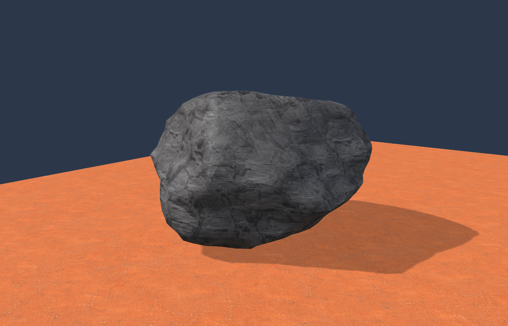
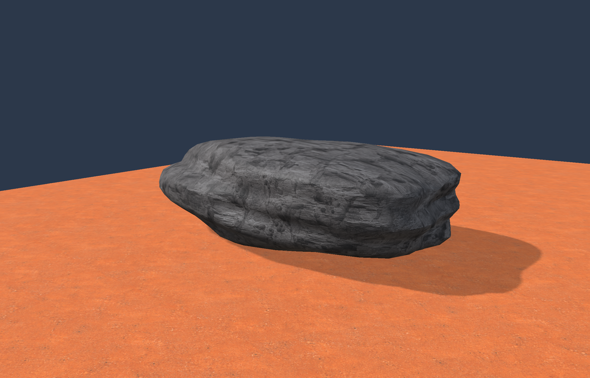
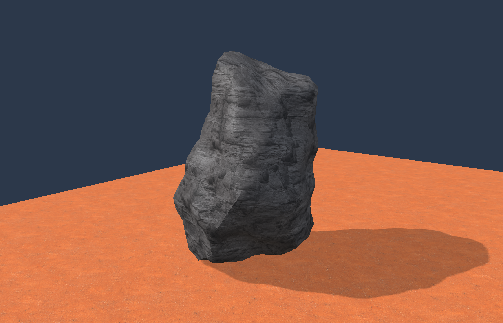

# Three editable wasteland rocks

Created in the native generator on 2026-09-10 at the user's request for better-looking rocks. These are actual Metal workbench renders using our existing rock and ground textures.

Open `Engine/out/rock-showcase-camera/Launch-Rock-Generator.command`. Choose **Rock preset** in the right-hand panel to switch between the examples. Alt/Option + left-drag or right-drag to orbit; Space + left-drag or middle-drag to pan; scroll to zoom; F to recenter. Change the seed or dimensions, **Apply recipe**, and **Save recipe** to keep the accepted result in your working copy. The source presets remain intact. **Undo/Redo** and **Export rock** use the same generated meshes as the preview.

## Weathered boulder

A broad, irregular mass with softened edges and layered surface detail. [Editable recipe](../Assets/RockPresets/01-Weathered-Boulder.json) · [Exported mesh](../Evidence/ROCK-showcase/01-Weathered-Boulder/captures/export/model.json)



## Layered slab

A low, wide stone with shallow bands and an uneven rim. [Editable recipe](../Assets/RockPresets/02-Layered-Slab.json) · [Exported mesh](../Evidence/ROCK-showcase/02-Layered-Slab/captures/export/model.json)



## Windworn outcrop

A taller, asymmetric form with a sloping crown and broad fracture faces. [Editable recipe](../Assets/RockPresets/03-Windworn-Outcrop.json) · [Exported mesh](../Evidence/ROCK-showcase/03-Windworn-Outcrop/captures/export/model.json)



## What changed

Generator version 2 samples a rounded block intersected by seeded fracture planes, then adds coherent broad relief, smaller erosion-like variation and slanted bands. Shared-position normals soften small triangles while retaining sharper creases. Each example has 2,048 triangles at its highest detail, with 512/128 triangle lower levels. Collision and export use the highest-detail mesh. The preview camera targets the rock's height rather than the old fixed fixture height, so the upright example fits in view.

[The inspection preset](../Assets/Inspection/rock-showcase.json) uses stronger illumination, restrained normal-map strength and a larger texture pattern to make the existing layered material readable. No texture images, shader algorithms or Unity assets were modified. The package adds a bounded preset selector and first-launch inspection defaults; later launches keep the working recipe and saved lighting settings.

Version 1 remains available and the existing world recipes stay on it. The new presets are an authoring collection, not an automatic replacement for streamed populations. Generated IDs, recipe versions, actual mesh bounds and footprint remain in the export. The authored preview collider has its own stable slot identity, allowing version/preset switches without changing the preview's body token. World placements, authored constraints and persisted removals are not rewritten by this workbench session. Population placement/performance and final geological art approval remain later integration/review work.

## Verification and rebuilding

[The native checks](../Evidence/ROCK-showcase-native/result.json) cover each preset's determinism, closed topology, normalized normals, grounding, lower-level identity and recipe roundtrip, alongside the legacy fixture checks. [The adapter check](../Evidence/ROCK-art-adapters/result.json) retains edit/undo/collision and exact-export coverage. [The build](../Evidence/ROCK-showcase-build/result.json) includes both apps and the cooker. [The packaged result](../Evidence/ROCK-showcase/result.json) verifies all 42 payload files, preserves the working recipe and records three real-texture Metal captures with zero GPU errors. Captures and exact accepted native-format mesh exports are retained beside that result. Workbench appearance was visually inspected; Windows and hands-on gameplay remain unverified.

From `Engine/`, package a fresh copy with the existing cooked materials:

```sh
python3 Tools/package_workbench.py --build build/foundation --out out/my-rock-showcase --catalog out/surfaces-accepted-a/catalog.json --model out/models/calibration/model.json --rock Assets/RockPresets/01-Weathered-Boulder.json --rock-library Assets/RockPresets --inspection Assets/Inspection/rock-showcase.json
```

For a single scene-only capture and exact mesh export, use `engine_workbench --rock recipe.json --catalog catalog.json --inspection inspection.json --capture-rock new-directory`. This mode pauses simulation and hides the inspector in the image; it does not modify the input recipe. The dedicated original `out/rock-generator/` package and the existing world-save profiles remain untouched.
