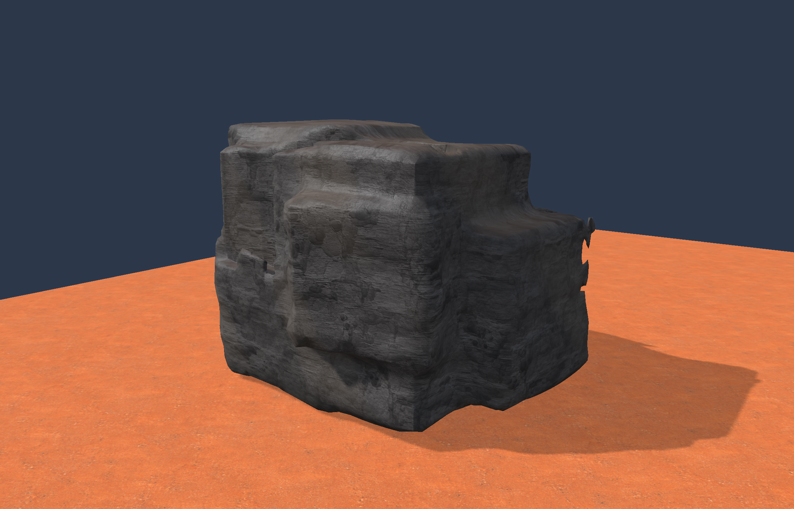
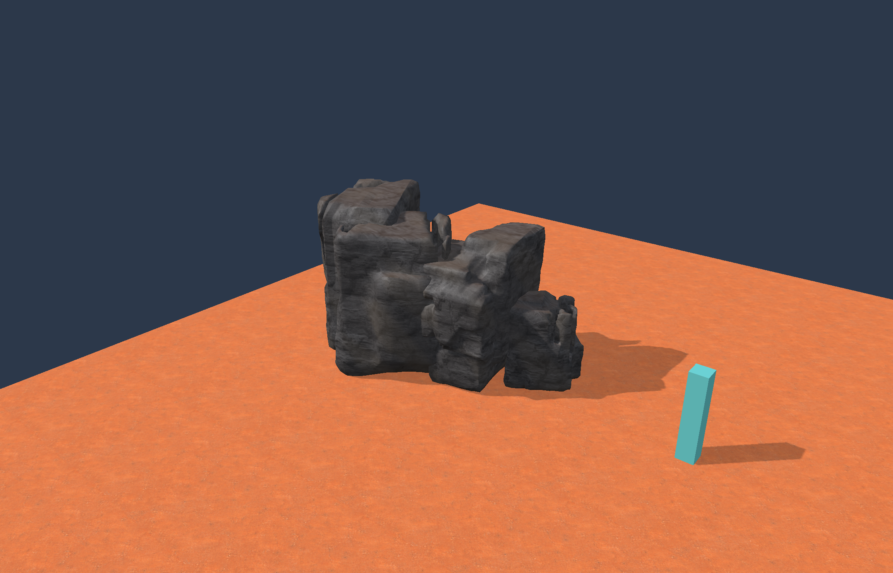

# Native rock transfer: working first pass

Open `Engine/out/rock-transfer-v3/Launch-Rock-Generator.command`. The package contains the updated scene camera and top-right Engine menu, four new presets, the layered rock material, and the complete cooked texture catalog. Unity remains untouched.

## What now works

- **Fused volumes v3:** seeded additive masses with smooth field unions, subtractive fracture cuts, edge rounding and coherent relief. Width/height/depth, compaction, lopsidedness, fractures and damage feed the plan. The bounded tetrahedral mesher generates closed, consistently oriented geometry and retains the largest connected body of each rock.
- **Editable source volumes:** expand Source volumes and choose Edit generated volumes. Adjust each mass/cut's center, size, yaw and operation. Apply recipe accepts the edit; Return to seeded plan restores procedural planning. Volumes use normalized authoring space; the finished body is fitted to the requested physical dimensions.
- **Layered original textures:** side/top/underside/grit normal and surface maps, crack/halo/mineral mask, upward dust, patch variation and worn shine. The preserved bindings intentionally reuse side albedo across four color slots. Surface channels remain AO/roughness/height, not metallic. [Material mapping](../Assets/Materials/wasteland-layered-v1.json) documents the compiled first-pass adapter.
- **Small formations:** outcrop, scatter and pile arrangements use stable child IDs and individual seeded rocks. A height-query callback seats the generated vertices against the support surface; the workbench uses its flat ground. Members are assembled into a static preview/export mesh and collision body. Frame rock / formation fits the accepted result; choosing a preset also requests framing.
- **Existing tool loop:** apply, undo/redo, recipe save/reload, three LODs, highest-detail collision and exact accepted-mesh export. V3 exports material-family/binding/control metadata and member IDs. Old v1/v2 recipes retain their generator paths and seven-field serialization.

The package contains all **38 transferred rock/ground textures**, plus three diagnostic textures. The five original source-art files remain preserved in the repo's surface library. The runtime loads shared leases for the active material and selected texture preview; the entire catalog is not kept resident at once.

## Presets rendered by the native engine

[Fractured Boulder](../Assets/FusedRockPresets/01-Fractured-Boulder.json) · [Shale Outcrop](../Assets/FusedRockPresets/02-Shale-Outcrop.json) · [Wasteland Scatter](../Assets/FusedRockPresets/03-Wasteland-Scatter.json) · [Rock Pile](../Assets/FusedRockPresets/04-Rock-Pile.json)

## Verification

- [New native cases](../Evidence/ROCK-transfer-native-final/result.json): repeatable geometry, seed/cut/source-volume effects, closed topology and positive winding, normalized normals, document/history preservation, LOD identities, collision presence, exact exported topology and material identity, distinct formation children and terrain seating. The native test identity produces a 23,436-triangle boulder; the workbench identity produces a different deterministic variant.
- [Legacy generation cases](../Evidence/ROCK-transfer-legacy/result.json): existing v1/v2 geometry, presets and placement constraints still pass.
- [Existing document/adapter cases](../Evidence/ROCK-transfer-documents/result.json): inspection settings, atomic accepted edit behavior, save/reload and render-triangle collision agreement still pass.
- Native Mac Metal captured all four presets and a material-control variant, each with real source textures and zero GPU errors. [The material comparison](../Evidence/ROCK-transfer-final/material-comparison.json) changes 30,624 sampled scene pixels while keeping exported mesh bytes identical. Boulder, outcrop and pile captures were visually inspected.
- [Package verification](../Evidence/ROCK-transfer-final/package.json): 80 payload hashes match; all 38 transferred texture IDs are present; packaged workbench matches the verified binary. Native workbench, player and rock cooker built successfully.

An early grid-intersection check exposed tiny triangles near exact isosurface samples. Minimum signed sample separation fixed collision degeneracy while retaining shared edge topology. Earlier diagnostic outputs are preserved only in ignored local cache.

## Deliberate first-pass limits

This is a native implementation of the concepts, not an exact C# random-sequence or Unity pixel match. Formation members may overlap; they are not welded into one manifold formation-wide field, independently destructible bodies, or a live-world placement rollout. Single-rock source edits retain only the largest connected component. Pile is a compact grounded assembly, not a physics stack.

The sampler and mesh budgets are bounded; an overly detailed formation is rejected with a reduce-detail/member-count message. Tiny physical dimensions can also exceed the existing collision triangle quality limits. Native Windows execution and physical gameplay feel remain unverified. Source height maps are preserved and influence material color/response, but do not implement geometric texture displacement. Ground-material blending, sand drifts, contact-occlusion baking, detailed geological seams, and Unity's full formation/style catalog remain later work.

World seed/generator version, authored volume constraints and structural IDs remain separate from GPU handles. V3 single-rock terrain footprints use the physical horizontal diagonal. Formation recipes are explicitly rejected by the existing live terrain scatter path until that integration is designed, preventing multi-member bounds from bypassing authored route/exclusion checks. Preview edits do not mutate world saves, chunks or persisted runtime deltas.
