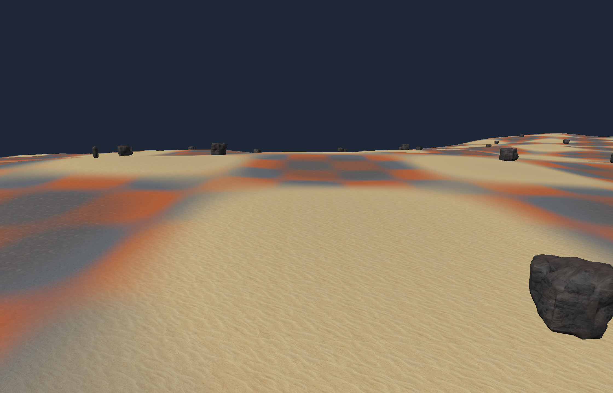

# First wasteland terrain preview

2026-09-10. Open `Engine/out/wasteland-preview/Launch-Wasteland.command` on Mac.
The package has its own world profile and does not overwrite the rock workbench.

This connects the existing terrain/streaming runtime to continuous seeded terrain
v2, original ground materials and low-detail v3 boulders. Region borders are no
longer forced into flat grid corridors. Full terrain samples are 4 m apart; three
render LODs use 4/8/16 m spacing with skirts to cover mixed-resolution edge gaps.
Collision and surface queries always use the full-resolution triangles.

Ground blends the transferred dirt, swept sand, gravel and mixed rocky albedos,
with the paired rocky normal map. Color transitions remain a provisional first
pass. Boulders use the existing layered material. Four shared seeded rock variants
are placed into stable cell slots and seated against terrain triangles with 12 cm
burial. Terrain v2 limits each region to 32 candidate slots; rejected candidates
never renumber surviving identities. Multi-member formation placement is deferred.

## Controls and persistence

- Option/Alt + left-drag or right-drag orbits; middle-drag or Space + left-drag pans;
  wheel zooms. Scene-camera movement updates the existing streaming anchor.
- The terrain panel switches between scene and character cameras. Character mode
  uses the existing WASD/Space/right-drag controls and nearby-rock removal.
- Save world/F5 persists player state and removed-rock deltas. Inspection settings
  save on exit. The material-blend toggle is a temporary preview comparison.
- Defaults are in `bin/Assets/Recipes`; change recipe inputs with a new world
  profile rather than reusing an incompatible save. Old terrain v1 still loads
  through its original geometry/placement path. No saved world is auto-upgraded.

## Verification

[Native checks](../Evidence/TERRAIN-preview-native/result.json) passed for positive,
negative and very large region seams/normals, terrain triangle/query agreement,
LOD sampling/reduction, authored route clearance, v3 rock seating, actual Jolt
attachment, removal/save/reload and collision retirement. The nine-region test
used 28,290,624 CPU resident bytes. Render LODs have 8,704 / 2,304 / 640 triangles
including skirts; collision has 8,192 terrain triangles per region.

The existing v1 terrain/jobs and region-stream checks passed. Existing save checks
passed interruption/corruption recovery and compatibility preservation.
[Logs and package hashes](../Evidence/TERRAIN-preview-checks/result.json) bind the
source and installed binary. Both workbench and player compiled on Mac; this result
verifies the new layered terrain presentation in the workbench.

[The packaged Metal run](../Evidence/TERRAIN-preview-metal/stream.json) produced
three captures with real textures and zero GPU errors. Eighteen regions retired;
vertex/index buffer counts returned to 41/34 after returning to the starting area.
The final origin capture was visually inspected. Simulation remained paused for
this rendering check. An initial framing capture is retained in the ignored cache;
the final camera accounts for the raised surface.

## Scope and next work

This is an outdoor foundation, not final landscape art. The active neighborhood
remains 3x3 regions with bounded hysteresis. Discrete LOD changes, distant edges,
the small existing shadow volume and four repeating rock variants are visible
limitations. Scene-camera panning is bounded to the current local working area.
Authored routes reserve placement clearance; terrain grading and AI navigation
are not supplied. Windows execution and hands-on gameplay feel remain unverified.

No imported heightmap adapter, sculpting, erosion, voxel terrain, sand drift
simulation or origin shifting was added. [Research](../Research/TERRAIN_SYSTEM_RESEARCH.md)
records the external-library/tool comparison and later heightmap import contract.
The [implementation plan](./TERRAIN_PREVIEW_PLAN.md) is complete for this bounded pass.
Next work should use this preview to choose terrain scale/material treatment and
rock distribution before adding more terrain infrastructure.
