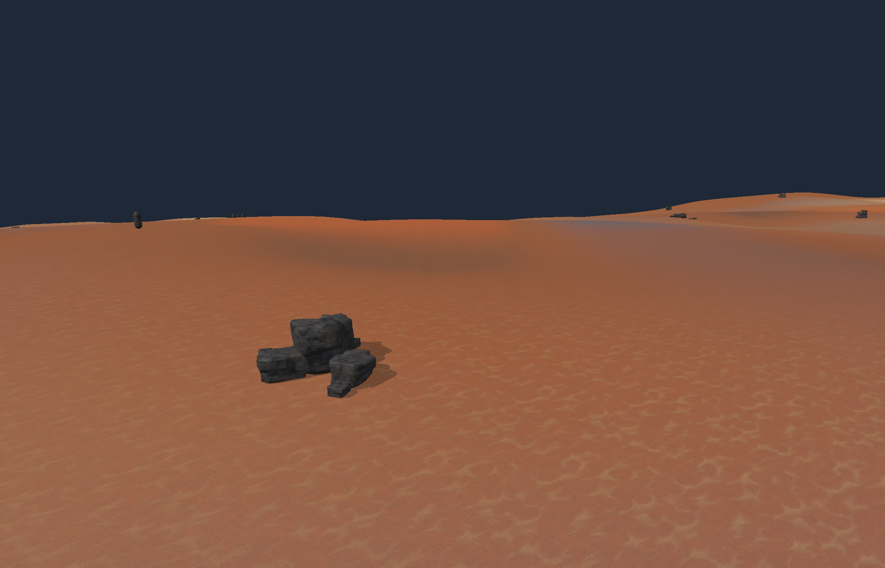
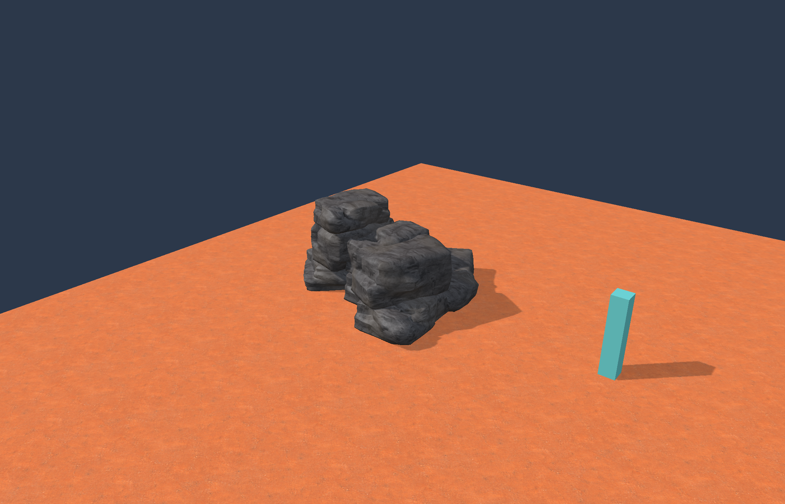

# Unity formation transfer: composition and live placement

2026-09-10. This pass connects the Unity prototype's formation concepts to the native
rock workbench and wasteland preview. It is a closer working foundation, not exact
Unity geometry or final art parity.

Open either local Mac package:

- [Wasteland formations](../out/unity-formation-parity/Launch-Wasteland.command):
  streamed groups on terrain, with the original ground transitions.
- [Formation workbench](../out/formation-workbench-v4/Launch-Rock-Generator.command):
  four editable presets, initially Layered Pile. Choose Rock preset, edit controls,
  then Apply recipe. Frame rock / formation fits the result; Save recipe saves the
  working copy. Library originals remain unchanged.

Both retain Option/Alt + left-drag orbit, Space + left-drag or middle-drag pan, and
wheel zoom. Each has its own UserData. Earlier packages remain available.

## What was carried over

The current serialized Unity prototype has an active Mixed Formation Ground sandbox
referencing MixedPileScatterReference and Greybox_Terrain. Its settings include
variation, burial, sand buildup and clutter. The saved MixedPileScatter asset retains
19 source member identities. The generator code distinguishes dominant anchors,
buttresses, pillars, talus, base slabs, middle supports and caps. The terrain shader
uses deposit/erosion/exposure signals and specific transition images.

These findings come from read-only source inspection and the retained historical
screenshot, not a live Unity session. [Source hashes](../Evidence/FORMATION-parity-source/inputs.json)
identify the inspected inputs. The September 6 reference image predates the later
accepted ground treatment; no screenshot was treated as current scene proof.

The [audited implementation plan](./UNITY_FORMATION_PARITY_PLAN.md) selected:

- **Generator v4:** braced outcrop, scattered stones, layered pile and low ridge.
  Member roles control proportions and placement. Piles have explicit base/middle/cap
  hosts; actual mesh contact queries seat supported members. Mixed layout distributes
  those four kinds by stable group slot. It does not create all four within one group.
- **Live groups:** terrain v3 places up to eight candidate groups per 256 m region,
  with six members in the bundled recipe and four shared base meshes. Individual
  proportions and yaw reach both render and collision. Authored exclusions/routes
  use conservative whole-group footprints. Removing a nearby formation removes its
  entire group and persists that delta across reload.
- **Ground transitions:** broad irregular masks replace the previous periodic color
  patches, using the original swept sand, gravel and rocky transition albedos and
  the source blend thresholds. Material masks approximate semantic geology; they
  do not simulate erosion or sand deposition. All 38 transferred texture IDs remain
  available, plus three diagnostics. No new source textures were necessary.
- **Version boundaries:** rock v1–v3 and terrain v1/v2 retain their existing paths.
  Live v4 groups require terrain v3 and a new compatible world profile. No save-file
  migration or Unity dependency was introduced.

## Verification and practical limits

[Focused native checks](../Evidence/FORMATION-parity-native-final/result.json) passed
for all four kinds, deterministic geometry, recipe roundtrips, normalized transformed
normals, distinct member IDs, support order, matching member/collider positions,
whole-group exclusions, persisted removal and stable unload/reload. Nine regions
used 27,490,824 resident CPU bytes; the origin region contained 42 members before
removal. Existing terrain/jobs and region tests passed, as did the v3 fused generator
regression. Workbench and player built with Apple LLVM 21.

[Metal streaming verification](../Evidence/FORMATION-parity-metal/stream.json) captured
origin, distant and returned views, retiring 18 regions with zero GPU errors and
unchanged vertex/index buffer counts. All four packaged authoring presets rendered
and exported successfully. Terrain origin, pile and ridge images were inspected.
[Package and check receipt](../Evidence/FORMATION-parity-checks/result.json) binds
payloads to current source hashes. No gameplay simulation advanced in the captures.

The first authoring defaults exceeded the 300,000-index mesh budget; the shipped
presets use detail 1 and eight members, with two available mesh LODs. Streamed members
use detail 0 and one mesh level; terrain retains three render LODs. Budgets were not
raised. More detail remains editable and may be rejected if the formation exceeds
capacity. The preview is sparse and visibly assembled, with block-like members and
limited local shadows. It is not a Windows performance or final-art acceptance result.

The next work in this same lane is formation-wide fused shells and geological seam
masks, followed by the prototype's sand-contact banks and ground clutter. Per-member
authoring, restrained lean, richer silhouettes and artist-controlled composition
remain gaps. The current hosted assemblies are static geometry, not physically
settling stacks. Canyons and origin shifting remain outside this pass.

## Reproduce

From the repository root, configure/build with the existing foundation CMake setup.
Run `engine_formation_parity_tests` with the terrain-v3 recipe, formations-v4 recipe
and a new Engine-local output directory. Existing CTest names are `terrain_jobs`
and `region_stream`; the v3 regression executable takes the Fractured-Boulder preset
under Assets/FusedRockPresets and a new output directory.

Package with `Tools/package_workbench.py` from the existing cooked catalog. Paths
passed to that script are relative to Engine. Use `--terrain`, `--stream-rock` and
`--inspection` for the wasteland package, or `--rock`, `--rock-library` and
`--inspection` for authoring. The native `--verify-stream` and `--capture-rock` modes
produce bounded render-only captures. New output directories are required.
