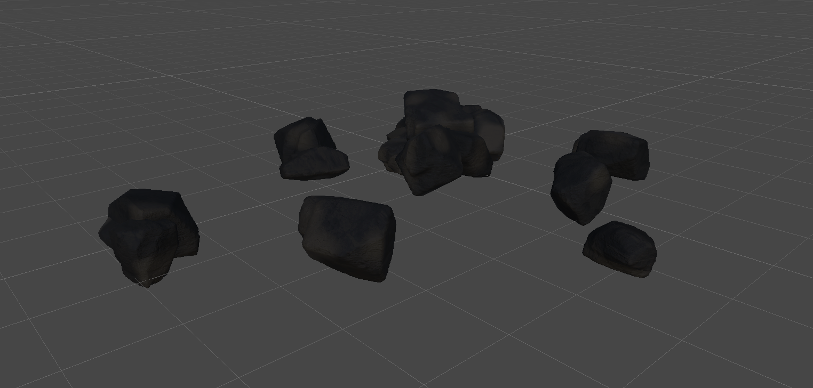

# Curated References

[source-manifest.json](./source-manifest.json) records source paths, content hashes, repository revisions, dirty status and collected-copy locations. A working-file hash matters when the source has uncommitted changes; HEAD alone cannot reproduce that content.

## Visual Reference

[Historical top view](./Visuals/MixedPileScatter_Top_2026-09-06.png).

Both images are dated 2026-09-06 and were collected as shape/layout references. They predate the 2026-09-08 acceptance of combined variations and sand banks recorded in the source production plan. They are **not** a screenshot of that final accepted appearance, a third-person quality target, or new-engine rendering evidence.

The [source rock production plan](../../Docs/ROCK_QUALITY_AND_PRODUCTION_PLAN.md) provides acceptance history. The saved source formation and selected code files are indexed in the manifest rather than bulk-copied into engine runtime content. A current accepted visual capture remains missing; do not manufacture one by silently rendering or modifying the Unity scene.

## Technical Retrieval Map

| Manifest ID | Use | Portability limit |
|---|---|---|
| `formation-data` | Source/member composition and serialized settings | Unity-specific serialization and mesh/material references |
| `shape-wrapper` | Seeded shape generation, source-envelope normalization and temporary mesh ownership | Creates Unity GameObjects and Unity meshes; not standalone C++ logic |
| `formation-contract` | Stable member source IDs and authored composition structure | ScriptableObject/Unity types must be redesigned |
| `sand-contact` | Ground-contact and sediment treatment reference | Inspect exact algorithm before porting; not a new-engine implementation |
| `rock-acceptance` | What was accepted versus deferred | Historical proof only |

For third-person review collect eye-level front/side/back views, ground-contact close-ups, a character scale reference, and fixed near/mid/far views under declared lighting. Preserve the source date and acceptance status for each. No new visual material was generated during preparation.

## World Context

[WORLD_CONTEXT.md](./WORLD_CONTEXT.md) summarizes the narrow Lorekeeper retrieval and separates source proposals from accepted game direction. It is a provenance-aware planning reference, not a replacement lore encyclopedia.
